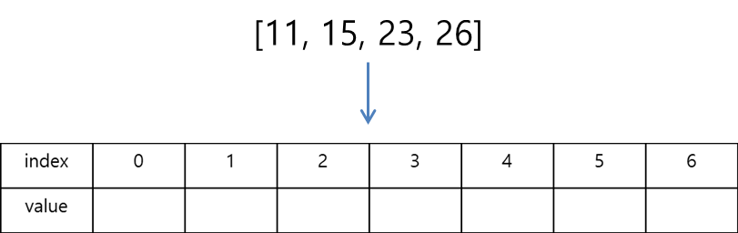
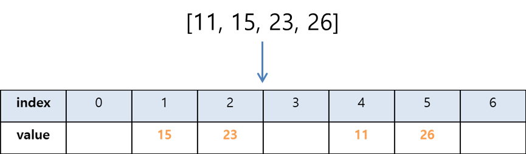
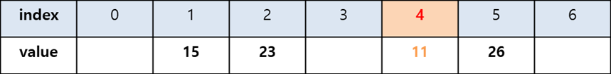
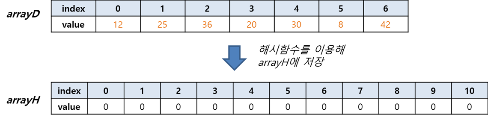

# Chap06 - 해시 탐색법 Hash Search

## 1. 해시 탐색법 개념 이해하기

앞에서 배운 선형 탐색법이나 이진 탐색법의 전제 조건은 어떤 데이터가 어느 index에 들어 있는지 전혀 모르는 상태에서 검색을 시작한다는 것이었다. 하지만, 이번에 배울 *해시 탐색법* 은 데이터의 *'내용'* 과 저장한 곳의 *'index'* 를 미리 연결해 줌으로써 짧은 시간에 탐색할 수 있도록 고안된 알고리즘 이다. <br />

해시 탐색법은 *'데이터를 데이터와 같은 index에 넣어 두면 한 번에 찾을 수 있지 않을까?'* 라는 생각에서 시작된다. 예를 들어, $24$ 인 데이터는 index $24$ 에 넣어 두고, $36$ 은 index $36$ 에 넣어두는 방법이다. <br />

이러한 방법은 원하는 데이터를 확실히 쉽게 찾을 수 있지만, 위의 예시 처럼 $24, 36$ 의 데이터를 보관하기 위해서는 최소한 index가 $0 \sim  36$ 까지인 37개의 배열이 필요하다. 이렇게 되면 불필요한 배열이 생기게 된다. <br />

좀 더 효율적으로 배열을 사용하기 위해 데이터에 일정한 계산을 적용한 뒤 index 에 보관하는 방법을 고려해 볼 수 있다. 예를 들어, 위의 예제에서 '$data \div 12$의 index를 가지는 배열에 저장' 하는 방법을 이용하면 $24$ 는 index $2$ 인 배열에 들어가고, $36$은 index $3$인 배열에 들어가게 되므로 필요한 배열의 개수는 4개면 충분하게 된다. <br />

위의 경우 처럼 해시 탐색법에서 반드시 나누기($\div$) 만 사용해야만 하는 것은 아니다. 나누기, 나머지 등 다양한 방법을 사용할 수 있다. <br />

이번에는 아래와 같이 크기가 7인 배열(index: 0~ 6)에 `[11, 15, 23, 26]` 을 넣어보도록 하자.



현재, 배열의 크기가 7이므로 index는 0 ~ 6 까지 존재한다. 위의 데이터를 이 배열에 넣기 위해서는 데이터에 어떠한 계산을 적용한 후 배열에 넣어주는 방법이 있다.  배열의 크기가 7이므로 데이터를 7로 나누고 그 나머지를 데이터가 들어갈 배열의 index라고 하면 아래와 같이 데이터를 넣어줄 수 있다.
$$
11 \% 7 =4 \\
15 \% 7 = 1 \\
23 \% 7 = 2 \\
26 \% 7 = 5
$$



이러한 계산을 통해 나온 결과값을 **'해시값'** 이라고 한다. 위의 예제에서의 해시값은 '숫자를 넣을 index 번호'이다.  <br />

이번에는 위에 데이터를 넣어둔 배열에서 해시 탐색법을 적용해서 11이라는 데이터가 어느 index에 있는지 찾아보도록 하자. 데이터의 위치를 찾기 위해서는 위에서 적용한 계산식($data \% 7$)를 재사용 하면 된다.
$$
11 \% 7 = 4
$$



## 2. 해시 함수로 데이터를 보관하는 알고리즘

위에서 살펴보았듯이 해시 탐색법을 구현하려면 데이터의 저장 및 검색 총 2개의 알고리즘이 필요하다. 

- *해시 함수로 데이터를 저장하는 알고리즘*
- *해시 함수로 데이터를 검색하는 알고리즘*

### 1) 해시 함수로 데이터를 저장하는 알고리즘

#### 배열을 2개 준비하기

아래와 같이 `arrayD`에 들어있는 데이터를 해시 함수를 적용하여 `arrayH`에 저장해보자. `arrayH`는 `arrayD`의 데이터 개수보다 1.5 ~ 2 배 큰 array를 준비한다. 그 이유는 뒤 부분에서 살표 보겠지만, 데이터가 해시 함수를 통해 나온 해시 값이 서로 같은 경우를 충돌이라고 하는데 이를 방지하기 위함이다. `arrayH`에는 초기값을 `arrayD`에 포함되어 있지 않는 데이터(예를 들어, 0 같은)로 초기화 한다. 여기서는 0으로 초기화한다.




#### `arrayD`의 데이터를 `arrayH`에 저장하기

`arrayH`의 길이가 `11`이므로 `arrayD`의 데이터를 *11로 나눈 나머지* 를 해시값으로 설정하자.

```
def 해시함수:
	해시값(arrayH의 index) = arrayD의 데이터 % 11
	return 해시값
```

먼저, `arrayD[0] = 12` 이므로, 해시함수를 적용하면 해시값은 `12 % 11 = 1` 이므로 `arrayH[1]`에 `12`를 저장한다.  그다음으로 `arrayD[1]=25`는 `25 % 11 = 3` 이기 때문에, `arrayH[3]`에 저장된다. 이제, `arrayD[2]=36`을 보자. `36 % 11 = 3`이어서, 바로 앞의 `25`의 위치인 `arrayH[3]`과 충돌이 일어나게 된다. 이러한 경우 해결책은 해당 index의 바로 옆(index + 1)이 비어 있으면 거기에 저장하면 된다. 즉, `36`은 `arrayH[3+1]=arrayH[4]`에 저장하면 된다. 이러한 이유로, 해시값으로 인한 충돌을 방지하기 위해 일반적으로 배열을 데이터 수의 1.5 ~ 2배로 만들어 준다. <br />

해시값 충돌을 고려하여 위와 같은 방법으로 `arrayH`에 데이터를 저장하게되면, `20`은 `array[9]`에 `30`은 `arrayH[8]`에 넣어준다. `arrayD[5]=8` 경우, 해시값이 `8`로 이미 `arrayH[8]=30`에 들어 있어 충돌이 일어나게 된다. 그런데 그 바로 옆인 `arrayH[9]`에는 `20`이 들어 있으므로 `arrayH[10]`에 `8`을 저장해 주어야 한다. 마찬가지로 `42`또한 충돌이 일어나므로,  `arrayH[0]`에 저장해준다. <br />해시함수 를 적용하여 저장된 `arrayH`는 아래와 같다.


#### 순서도로 나타내기

위에서 알아본 해시함수로 데이터 저장하기 알고리즘을 일반화하여 순서도로 나타내보자.

```flow
st=>start: Start
op1=>operation: i = 0
cond1=>condition: i < len(arrayD)
op1_y=>operation: arrayD[i] % len(arrayH) = k
op1_n=>operation: print arrayH
cond2=>condition: arrayH[k]=0
op2_y=>operation: arrayH[k]=arrayD[i]
op2_n=>operation: k = (k+1) % len(arrayH)
op3=>operation: i = i + 1
e=>end

st->op1->cond1->op1_y->cond2->op2_y->op3
cond1(yes)->op1_y
cond1(no)->op1_n->e
cond2(yes)->op2_y
cond2(no)->op2_n->cond2
op3(left)->cond1
```


#### 의사코드로 나타내기

이번에는 의사코드(pseudocode)로 나타내보자.

```
input arrayD, arrayH
	- arrayD : 데이터가 있는 배열
	- arrayH : 해시함수를 적용한 뒤 저장할 배열(0으로 초기화)

let i = 0

while i < len(arrayD):
	k = arrayD[i] % len(arrayH)
	if arrayH[k] is not 0:
		while arrayH[k] is not 0:
			k = (k+1) % len(arrayH)
		arrayH[k] = arrayD[i]
	else:
		arrayH[k] = arrayD[i]
	i = i + 1
	
print arrayH
```


#### Python 코트로 구현하기

위의 의사코드를 토대로 python 코드로 구현해보자.

```python
def hash_table(arr):
    h_len = round(len(arr) * 1.5 + 0.5)
    h_arr = [0 for i in range(h_len)]
    
    i = 0
    while i < len(arr):
        k = arr[i] % h_len
        if h_arr[k] is not 0:
            while h_arr[k] is not 0:
                k = (k + 1) % h_len
            h_arr[k] = arr[i]
        else:
            h_arr[k] = arr[i]
        i += 1
    return h_arr


array_d = [12, 25, 36, 20, 30, 8, 42]
print(hash_table(array_d))
'''
>>> [42, 12, 0, 25, 36, 0, 0, 0, 30, 20, 8]
''' 
```


### 2) 해시 함수로 데이터를 검색하는 알고리즘

해시함수를 이용하여 데이터를 검색하는 알고리즘은 위의 *1) 해시 함수로 데이터를 저장하는 알고리즘* 과 크게 다르지 않다. 

우리는 위에서 해시함수를 다음과 같이 정의한 적이 있다.

```
def 해시함수:
	해시값(arrayH의 index) = arrayD의 데이터 % 11
	return 해시값
```
이 함수를 이용하여 `12` 위치(index)를 찾아보자. 해시함수에 의해 해시값은 `12 % 11 = 1`이므로 12의 위치는 `arrayH[1]`에 위치하게 된다. <br />이번에는 `36`의 위치를 찾아보자. 36의 해시값은 `36 % 11 = 3`이 되지만, `arrayH[3]=25`이므로 25라는 데이터가 존재한다. 이러한 경우, 위의 방법에서와 마찬가지로 위치를 1만큼 (즉, index + 1)증가시켜 해당 데이터를 찾는다. 따라서, 36은 `arrayH[3+1]=arrayH[4]=36` index 4에 위치하게 된다.

#### 검색하고자 하는 데이터가 존재하지 않을 경우

검색하고자 하는 데이터가 존재하지 않을 경우에는 index의 값은 계속 1씩 증가하게 되므로 무한 루프에 빠지게 된다. 이러한 경우에는 index가 1씩 증가 시킬 때 마다 그 배열의 값이 0인지 아닌지를 판별해 주면 된다.  그 이유는 우리가 찾고자 하는 데이터는 충돌이 일어나도 index 를 1씩 증가시키면 나타나기 마련인데, 0 이 나오는 경우는 우리가 찾고자 하는 데이터가 없는 경우를 말한다고 할 수 있기 때문이다.

#### 순서도로 나타내기

해시 함수로 데이터를 검색하는 알고리즘을 순서도로 나타내보자.

```flow
st=>start: Start
op1=>operation: x 를 입력한다.
op2=>operation: k = x % len(arrayH)
cond1=>condition: arrayH[k] != 0
opc1_n=>operation: print 'Not Found'
cond2=>condition: arrayH[k] = x
opc2_y=>operation: print 'x는 k번째 위치'
opc2_n=>operation: k = (k + 1) % len(arrayH)
e=>end: end

st->op1->op2->cond1->cond2->opc2_y->e
cond1(yes)->cond2
cond1(no)->opc1_n->e
cond2(yes)->opc2_y->e
cond2(no)->opc2_n->cond1
```


#### 의사코드로 나타내기

```
input arrayH

let x which you want to find
let k = x % len(arrayH)

while arrayH[k] is not 0:
	if arrayH[k] is x:
		print 'x is in index k'
	else:
		k = (k+1) % len(arrayH)

if Not Found:
	print 'Not Found'
```


#### Python 코드로 구현하기

이제 마지막으로  해시 함수로 데이터를 검색하는 알고리즘을 위의 의사코드를 토대로 python 코드로 구현해 보자.

```python
def hash_search(arr, x):
    
    k = x % len(arr)
    while arr[k] is not 0:
        if arr[k] is x:
            return k
        else:
            k = (k+1) % len(arr)
    return 'Not Found'


array_d = [12, 25, 36, 20, 30, 8, 42]
array_h = hash_table(array_d)
print(array_h)
print(hash_search(array_h, 8))
'''
>>> [42, 12, 0, 25, 36, 0, 0, 0, 30, 20, 8]
>>> 10
'''
```


