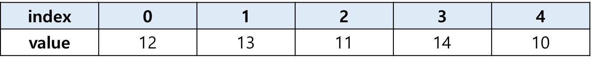
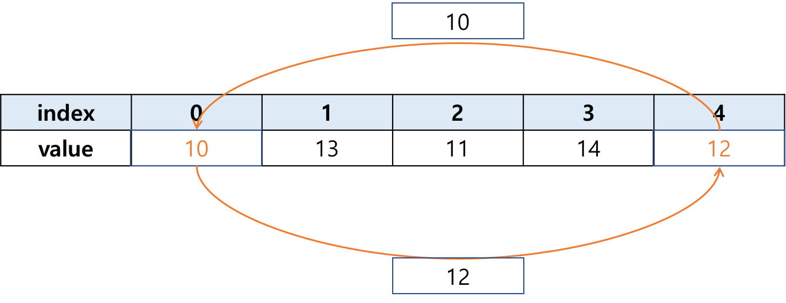
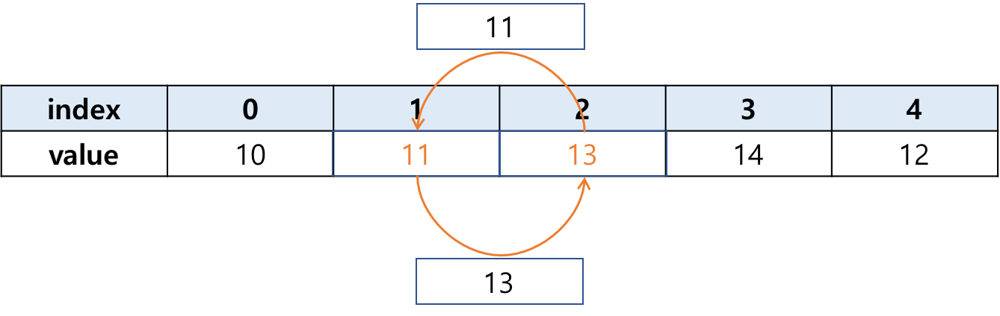
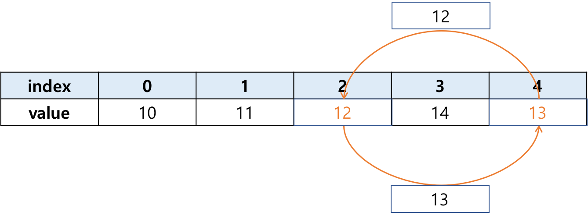
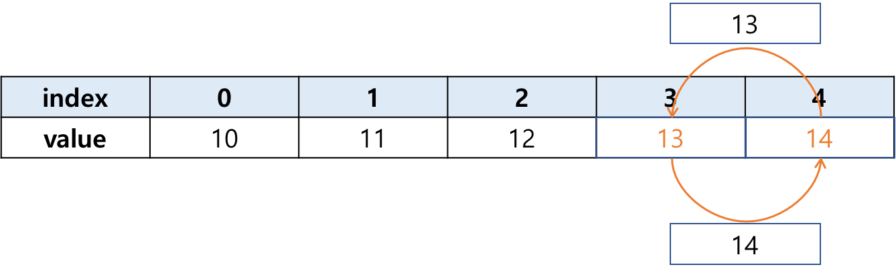

# Chap07 - 단순 선택법(선택 정렬)

## 1. 단순 선택법 개념 이해하기

단순 선택법은 졍렬되어 있지 않은 데이터 중 가장 작은 데이터를 선택하여 맨 앞부터 순서대로 정렬해 나가는 알고리즘으로써 *'선택 정렬(Selection sort)'* 라고도 한다. <br />

예를 들어 아래의 표 처럼 5개의 배열(array)에 `[12, 13, 11, 14, 10]`이 있다고 해보자.



위의 배열을 선택 정렬 알고리즘을 이용하여 오름차순으로 정렬해보자.  <br />

선택 정렬 알고리즘은 

- 먼저, 가장 작은 숫자를 찾는다. 
- 그런 다음 가장 작은 숫자를 첫 번째 index의 공과 위치를 바꿔 준다.  

위의 두 가지 동작을 반복하면서 모든 숫자가 정렬될 때까지 반복하는 알고리즘이다. 다음 그림을 통해 선택 정렬 알고리즘을 알아보도록 하자.









위의 그림 처럼 해당 단계마다 가장 작은 숫자를 찾아 정렬이 되지 않은 index의 위치와 숫자를 바꿔주면 된다. 


## 2. 단순 선택법 알고리즘

단순 선택법(선택 정렬)은 다음과 같이 두 가지 절차로 구성되어 있다.

- 1) 탐색 범위의 최소값을 찾는 처리
- 2) 탐색 범위의 최소값을 맨 앞의 요소와 교환하는 처리

### 1) 배열에서 최소값 찾기

배열에서 최소값을 찾는 방법은 배열의 길이만큼(length) 순환하면서 각 데이터를 차례대로 2개씩 비교하면 된다. 여기서는 최소값이아닌 최소값의 위치 즉, index를 찾아야 한다.

### 2) 최소값의 위치를 교환하는 처리

이제 최소값의 위치를 찾았으므로, 이 최소값을 위의 그림처럼 맨 앞의 index와 위치를 교환해주는 처리가 필요하다. 


## 3. 단순 선택법을 순서도로 나타내기

위의 2번에서의 1), 2) 과정을 일반화 하여 순서도로 나타내 보자.

```flow
st=>start: Start
op1=>operation: i = 0
cond1=>condition: i < len(array)-1
c1_y=>operation: min_index = i
c1_n=>operation: print array
op2=>operation: k = i+1
cond2=>condition: k < len(array)
c2_y=>condition: array[k] < array[min_index]
c2_n=>operation: tmp = array[i]
op3=>operation: min_index = k
op4=>operation: k = k + 1
op5=>operation: array[i] = array[min_index]
op6=>operation: array[min_index] = tmp
op7=>operation: i  =  i  +  1
e=>end: end

st->op1->cond1
cond1(yes)->c1_y->op2->cond2
cond1(no)->c1_n->e
cond2(yes)->c2_y
cond2(no)->c2_n->op5->op6->op7(right)->cond1
c2_y(yes)->op3->op4(left)->cond2
c2_y(no, right)->op4
```


## 4. 의사코드로 나타내기

이제 파이썬 코드로 구현하기에 앞서, 의사코드를 알아보도록 하자.

```
input: array

let i = 0
for i in length(array)-1:
	min_index = i
	for k in (i+1 to length(array)):
		if array[k] < array[min_index]:
			min_index = k
	tmp = array[i]
	array[i] = array[min_index]
	array[min_index] = tmp
```


## 5. 파이썬 코드로 구현하기

아래의 코드는 선택 정렬 알고리즘을 파이썬 코드로 구현한 것이다.

```python
def selection_sort(arr):
    for i in range(len(arr)-1):
        min_index = i
        # 최소값 찾는 처리
        for k in range(i+1, len(arr)):
            if arr[k] < arr[min_index]:
                min_index = k
        # 최소값의 위치를 바꿔주는 처리
        tmp = arr[i]
        arr[i] = arr[min_index]
        arr[min_index] = tmp
    return arr


test = [12, 13, 11, 14, 10]
print(selection_sort(test))
'''
>>> [10, 11, 12, 13, 14]
'''
```

