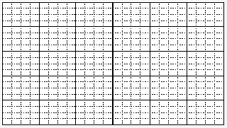
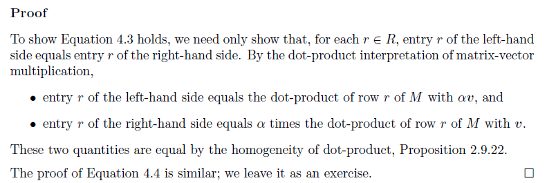
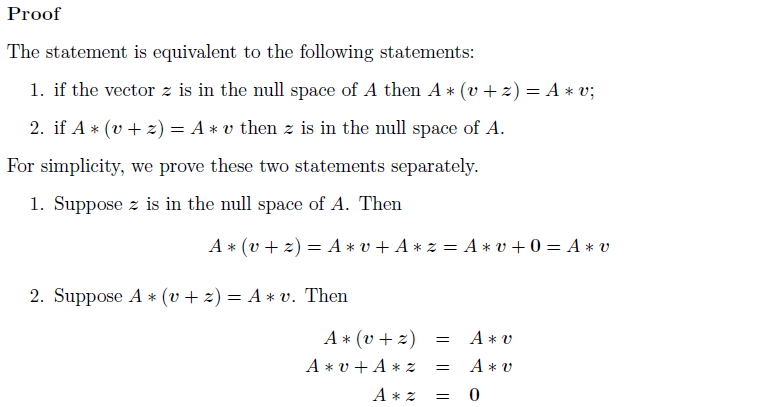
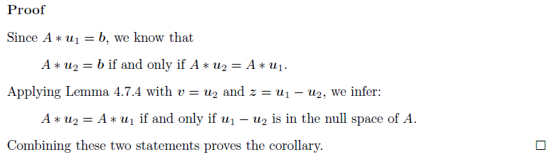

# Chap 05 - 행렬(The Matrix)

## 5.1 행렬이란 무엇인가?

### 5.1.1 전통적인 행렬

일반적으로, $m$개의 행과 $n$개의 열을 가진 행렬은 $m \times n$행렬이라 한다. 행렬 $A$에 대해 $i,j$ *원소* 는 $i$번쨰 행과 $j$번째 열에 있는 원소로 정의되며, 전통적으로 $a_{i,j}$ 또는 $a_{ij}$로 나타낸다. <br />따라서, $F$상의 모든 $i=1,...,m$과 $j=1,...,n$에 대하여 $a_{ij} \in F$일 때,

$$A = \begin{bmatrix} a_{ 11 } & a_{ 12 } & \cdots  & a_{ 1n } \\ a_{21} & a_{22} & \cdots & a_{2n} \\ \vdots & \vdots & \vdots & \vdots  \\ a_{m1} & a_{m2} & \cdots & a_{mn} \end{bmatrix}$$

을 $F$-위의 ($m \times n$)-행렬(($m \times n$)-matrix over $F$)이라고 한다.

### 5.1.2 행렬에 대해 알아보기

$F$상의 $D$-벡터를 집합 $D$에서 $F$로의 함수로 정의한거 처럼, $F$상의 $R \times C$ 행렬을 카테시안 곱 $R \times C$로의 함수로 정의한다. $R$의 원소를 *행 라벨* (row label) 이라 하고 $C$의 원소를 *열 라벨* (column label)이라 한다. <br />

**Example 5.1.3** 아래는 $R=$ `{'a', 'b'}`이고 $C=$`{'#', '@', '?'}`인 예이다. 

|      |  @   |  #   |  ?   |
| :--: | :--: | :--: | :--: |
|  a   |  1   |  2   |  3   |
|  b   |  10  |  20  |  30  |

### 5.1.3 행, 열, 엔트리

행렬의 유용한 점은 행과 열을 벡터로 해석할 수 있다. 위의 Example 5.1.3의 행렬을 아래와 같이 벡터로 나타낼 수 있다.

- 행 `a`는 벡터 [1, 2, 3] 이다.
- 행 `b`는 벡터 [10, 20, 30] 이다.
- 열 `@`는 벡터 [1, 10] 이다.
- 열 `#`은 벡터 [2, 20] 이다.
- 열 `?`는 벡터 [3, 30] 이다.

이번 5장에서는 행렬 구현 및 예제들을 파이썬의 고성능 수치 계산을 위한 모듈인 [NumPy](http://www.numpy.org/)를 사용한다. <br />numpy모듈을 이용하여 위의 Example 5.1.3을 다음과 같이 코드로 나타낼 수 있다.

```python
import numpy as np

M = np.matrix('1 2 3; 10 20 30')  # = np.matrix([[1, 2, 3], [10, 20, 30]])
print(M)

"""출력 결과
[[ 1  2  3]
 [10 20 30]]
"""
```

위와 같이 $R \times C$ 행렬 $M(r \in R, c \in C)$에 대해, $M$의 $r,c$원소는 $(r,c)$ 쌍이 매핑하는 것으로 정의 되며 $M_{r,c}$ 또는 $M[r,c]$로 나타내고, 행과 열은 아래와 같이 정의된다.

- $r \in R$에 대해, 행 $r$은 각 원소 $c \in C$에 대해 엔트리 $c$가 $M[r,c]$인 $C$-벡터 이다.
- $c \in C$에 대해, 열 $c$는 각 원소 $r \in R$에 대해 엔트리 $r$이 $M[r, c]$인 $R$-벡터 이다.

이를 numpy를 이용한 파이썬 코드로 나타내면 아래와 같다.

```python
# 1. 행(row)
print('첫 번째 행 :', M[0,:])
print('두 번째 행 :', M[1,:])

# 2. 열(column)
print('첫 번째 열 :\n', M[:,0])
print('두 번째 열 :\n', M[:,1])
print('세 번째 열 :\n', M[:,2])

"""출력결과
첫 번째 행 : [[1 2 3]]
두 번째 행 : [[10 20 30]]
첫 번째 열 :
 [[ 1]
 [10]]
두 번째 열 :
 [[ 2]
 [20]]
세 번째 열 :
 [[ 3]
 [30]]
"""
```

### 5.1.4 행렬의 파이썬 구현

교재에서는 `Mat`이라는 클래스를 별도로 구현하지만, 여기서는 위에서도 언급 했듯이 numpy 모듈을 이용해서 행렬을 구현하도록 한다. 다음 행렬을 numpy 모듈을 이용해서 구현해보자. 

$$M=\begin{bmatrix} 2 & 1 & 3 \\ 20 & 10 & 30 \end{bmatrix}$$

```python
import numpy as np

M = np.matrix('2 1 3; 20 10 30')
M

'''출력결과
matrix([[ 2,  1,  3],
        [20, 10, 30]])
'''
```

### 5.1.5 단위행렬 - Identity matrix 

***Definition*** : 유한 집합 $D$에 대해 $D \times D$ 단위행렬은 행-라벨 집합과 열-라벨 집합이 둘다 $D$이고 모든 $d \in D$에 대해 엔트리 ($d, d$)는 $1$ (다른 모든 엔트리는 0)인 행렬이다. 단위행렬은 $\mathbb{1}_D$로 나타낸다. <br />

numpy에서는 `identity()`를 이용해 단위행렬을 생성할 수 있다.

```python
# 2 x 2 단위행렬
i2 = np.identity(2)
# 3 x 3 단위행렬
i3 = np.identity(3)

print('2 x 2 단위행렬\n', i2)
print('3 x 3 단위행렬\n', i3)
'''출력결과
2 x 2 단위행렬
 [[ 1.  0.]
 [ 0.  1.]]

3 x 3 단위행렬
 [[ 1.  0.  0.]
 [ 0.  1.  0.]
 [ 0.  0.  1.]]
'''
```


## 5.2 열공간(Column space)과 행공간(Row space)

행렬은 여러가지 목적을 위해 사용되며 그 중 한 가지는 벡터들의 묶음을 만드는 데 사용된다. 행렬을 벡터들의 묶음으로 해석하는 두 가지 방법이 있다. 바로, 열들의 묶음과 행들의 묶음이다. 따라서, 행렬과 연관된 벡터공간은 두 개가 있게 된다. <br />

***Definition*** : 행렬 $M$에 대해,

- $M$의 *열공간(Column space)* 은 Col $M$으로 나타내며 $M$의 열들에 의해 생성된 벡터공간이다.
- $M$의 *행공간(Row space)*은 Row $M$으로 나타내며 $M$의 행들에 의해 생성된 벡터공간이다.

***Example 5.2.2*** : $\begin{bmatrix} 1 & 2 & 3 \\ 10 & 20 & 30 \end{bmatrix}$의 열공간은 $Span \{[1,10], [2,20], [3,30]\}$ 이다. 이 경우 $[2,20], [3,30]$은 $[1,10]$의 **스칼라배**이므로 열공간은 $Span\{[1,10]\}$과 동일하다. 행공간은 $Span\{[1, 2, 3]\}$이다.


## 5.3 벡터로서의 행렬

위의 5.3에서 처럼 행렬은 벡터로 해석될 수 있다. $F$상의 $R\times S$행렬은 $R \times S$에서 $F$로의 함수이다. 따라서 $F$상의 $R \times S$-벡터로 해석될 수 있다. 이 해석을 이용하면 벡터 연산인 *스칼라-벡터 곱셈* 와 *벡터 덧셈* 을 행렬에 대해 사용할 수 있다.

```python
M = np.matrix([[1,2,3], [10, 20, 30]])

# 스칼라-벡터 곱셈
print('스칼라-벡터 곱셈\n',M * 2)
# 벡터 덧셈
print('벡터 덧셈\n', M+M)

'''출력결과
스칼라-벡터 곱셈
 [[ 2  4  6]
 [20 40 60]]
벡터 덧셈
 [[ 2  4  6]
 [20 40 60]]
'''
```

## 5.4 전치(Transpose)

행렬의 *전치* 는 행과 열을 바꾸는 것을 의미한다. <br />

***Definition*** : $P \times Q$행렬의 전치는 $M^T$로 나타내며, 모든 $i \in P, j \in Q$에 대해 $(M^T)_{j,i}=M_{i,j}$를 만족하는 $Q \times P$ 행렬이다. <br />

다음 행렬 M에 대한 전치행렬은 아래와 같다.

$$M=\begin{bmatrix} 2 & 1 & 3 \\ 20 & 10 & 30 \end{bmatrix} \quad M^T=\begin{bmatrix} 1 & 10 \\ 2 & 20 \\ 3 & 30 \end{bmatrix}$$

numpy 모듈에서는 [`numpy.matrix.transpose()`](https://docs.scipy.org/doc/numpy-1.13.0/reference/generated/numpy.matrix.transpose.html) 또는 [`numpy.matrix.T`](https://docs.scipy.org/doc/numpy-1.12.0/reference/generated/numpy.matrix.T.html) 로 전치행렬을 구할 수 있다.

```python
M = np.matrix([[1,2,3], [10, 20, 30]])

print('numpy.matrix.transpose() \n', M.transpose())
print('numpy.matrix.T \n', M.T)

'''출력결과
numpy.matrix.transpose() 
 [[ 1 10]
 [ 2 20]
 [ 3 30]]
numpy.matrix.T 
 [[ 1 10]
 [ 2 20]
 [ 3 30]]
'''
```

만약 $M^T=M$이면, 행렬 $M$은 ***대칭행렬(Symmetric Matrix)***이라 한다. 

```python
M = np.matrix([[1, 2], [2, 4]])

assert repr(M.T) == repr(M)
```


## 5.5 선형결합의 행렬-벡터 곱셈과 벡터-행렬 곱셈

### 5.5.1 선형결합의 행렬-벡터 곱셈

***Definition(행렬-벡터 곱셈의 선형결합 정의)*** : $M$을 $F$상의 $R \times C$행렬이라고 하고, $v$는 $F$상의 $C$-벡터라고 하면, $M * v$는 선형결합이다. 

$$\sum _{ c\in C }^{  }{ v[c] } \quad (M의\_열\_c)$$

만약 행렬 $M$이 $R \times C$ 이지만 $v$는 $C$-벡터가 아니면, $M * v$는 성립하지 않는다.  행렬의 열(column) 수는 벡터의 원소 개수와 일치해야 한다. 우리가 중, 고등학교 수학해서 행렬을 배울때 행렬의 곱셈이 성립 되는 규칙을 생각하면 된다. 아래의 예제를 보자. <br />

***Example 5.5.2*** :  <br />

$$\begin{matrix} \begin{bmatrix} 1 & 2 & 3 \\ 10 & 20 & 30 \end{bmatrix}*[7,0,4] & = & 7\begin{bmatrix} 1 \\ 10 \end{bmatrix}+0\begin{bmatrix} 2 \\ 20 \end{bmatrix}+4\begin{bmatrix} 3 \\ 30 \end{bmatrix} \\  & = & [7,70]+[0,0]+[12,120] \\  & = & [19,190] \end{matrix} $$

`numpy.dot`을 이용하여 벡터-행렬 곱셈을 구현할 수 있다. 

```python
M = np.matrix([[1,2,3], [10, 20, 30]])
v = [7, 0, 4]

print('M * v =', np.dot(M, v))
'''출력결과
M * v = [[ 19 190]]
'''
```

### 5.5.2 선형결합의 벡터-행렬 곱셈

***Definition(벡터-행렬 곱셈의 선형결합 정의)*** : $M$을 $R \times C$ 행렬이라 하고, $w$는 $R$-벡터라고 하면 $w * M$은 선형결합이다.

$$\sum _{ r\in R }^{  }{ w[r] } \quad (M의\_행\_r)$$

행렬과 벡터의 곱은 교환법칙이 성립되지 않는다. $M*v$는 성립하지만, $v *M$은 성립하지 않는 경우가 거의 대부분이다. <br />

***Example 5.5.7*** : <br />

$$\begin{matrix} [3,4]*\begin{bmatrix} 1 & 2 & 3 \\ 10 & 20 & 30 \end{bmatrix} & = & 3[1,2,3]+4[10,20,30] \\  & = & [3,6,9]+[40,80,120] \\  & = & [43,86,129] \end{matrix}$$

```python
M = np.matrix([[1,2,3], [10, 20, 30]])
w = [3, 4]

print('w * M =', np.dot(w, M))
'''출력결과
w * M = [[ 43  86 129]]
'''
```

5.5.3 생략

### 5.5.4 행렬-벡터 방정식의 해 구하기 

- ***input***: $R \times C$ 행렬 $A$와 $R$-벡터 $b$
- ***output***: $A * \hat{x} = b$를 만족하는 $C$-벡터 $\hat{x}$

***Example 5.5.14*** : [Example 4.4.13](https://github.com/ExcelsiorCJH/Study/blob/master/LinearAlgebra/CodingTheMatrix/Chap04%20-%20The%20Vector%20Space/Chap04-The_Vector_Space.ipynb) 에서 $Span\{[a,b],[c,d]\}$를 고려하였다. 이때, $a,b,c,d \in \mathbb{R}$이다.

- $[c,d]$가 $Span\{[a,b]\}$에 있지 않으면 $ad \neq bc$ 이다.
- 이 경우, $\mathbb{R}^2$의 모든 벡터 $[p,q]$에 대해 다음을 만족하는 계수 $\alpha , \beta$가 있다.

$$\begin{bmatrix} p \\ q \end{bmatrix}=\alpha \begin{bmatrix} a \\ b \end{bmatrix}+\beta \begin{bmatrix} c \\ d  \end{bmatrix}$$

$\alpha = \frac{dp-cq}{ad-bc}, \beta = \frac{aq-bp}{ad-bc}$ 라고 하면, 아래와 같이 쓸 수 있다. 

$$\begin{bmatrix} a & c \\ b & d \end{bmatrix} * \begin{bmatrix} \alpha  \\ \beta  \end{bmatrix} = \begin{bmatrix} p  \\ q  \end{bmatrix}$$

[`numpy.linalg.solve()`](https://docs.scipy.org/doc/numpy-1.13.0/reference/generated/numpy.linalg.solve.html) 를 이용해 행렬-벡터 방정식의 해를 구할 수 있다. 예를 들어 , 행렬방정식 $\begin{bmatrix} 1 & 2 \\ 3 & 4 \end{bmatrix}*\begin{bmatrix} \alpha \\ \beta \end{bmatrix}=\begin{bmatrix} -1 \\ 1 \end{bmatrix}$ 에서 $\begin{bmatrix} \alpha \\ \beta \end{bmatrix}$ 를 구한다고 할때, 아래와 같이 구할 수 있다.

```python
A = np.matrix([[1, 2], [3, 4]])
b = np.array([-1, 1])

x = np.linalg.solve(A, b)
print(x)
'''출력결과
[ 3. -2.]
'''
```


## 5.6 도트곱(dot-product)의 행렬-벡터 곱셈

### 5.6.1 정의

***Definition(행렬 -벡터 곱셈의 도트곱 정의)*** : $M$이 $R \times C$ 행렬이고 $u$는  $C$-벡터 이면, $M * u$는 $R$-벡터 $v$이다. 이때, $v[r]$은 $M$의 행 $r$과 $u$의 도트곱이다. <br />

***Definition(벡터-행렬 곱셈의 도트곱 정의)*** : $M$이 $R \times C$ 행렬이고 $u$는  $R$-벡터 이면, $u * M$은 $C$-벡터 $v$이다. 이때, $v[c]$은 $u$와 $M$의 열 $c$ 의 도트곱이다. <br />

***Example 5.6.2*** : 행렬-벡터 곱셈을 고려해 보자.

$$\begin{matrix} \begin{bmatrix} 1 & 2 \\ 3 & 4 \\ 10 & 0 \end{bmatrix}*[3,-1] & = & \begin{bmatrix} 1 & 2 \\ 3 & 4 \\ 10 & 0 \end{bmatrix}*\begin{bmatrix} 3 \\ -1 \end{bmatrix} \\  & = & 3\begin{bmatrix} 1 \\ 3 \\ 10 \end{bmatrix}-\begin{bmatrix} 2 \\ 4 \\ 0 \end{bmatrix} \\  & = & \begin{bmatrix} 1 \\ 5 \\ 30 \end{bmatrix} \\  & = & [1,5,30] \end{matrix}$$

```python
M = np.matrix([[1, 2], [3, 4], [10, 0]])
v = [3, -1]

dot_prod = np.dot(M, v)
print(dot_prod)
print('dot_prod shape: {}'.format(dot_prod.shape))

'''출력결과
[[ 1  5 30]]
dot_prod shape: (1, 3)
'''
```


### 5.6.2 응용 예

***Example 5.6.4*** : 고해상도 이미지가 있다고 해 보자. 이 이미지의 해상도를 줄여 *다운샘플링(downsampling)*을 한다고 해보자. <br />

아래의 그림처럼 원래의 이미지를 ($4 \times 4$) 크기 만큼 그룹을 지어 그 그룹의 평균을 저해상도의 이미지 픽셀값으로 설정한다.



아래의 코드는 파이썬에서 `pillow`라는 모듈을 이용하여 이미지 파일을 불러오고 `Image.resize()`메소드를 이용해 사이즈를 4배 축소해준 예제 및 `for`문을 순회 하면서 위의 설명 처럼 ($4 \times 4$) 크기 만큼 그룹을 만들어 그 값의 평균을 픽셀값으로 지정하여 `img_r`이라는 이미지 행렬을 만들어 준 예제이다.

```python
%matplotlib inline
import matplotlib.pyplot as plt
from PIL import Image

# 이미지 파일 불러오기
img = Image.open('./images/original.png') 
img = img.convert('L')
img_org = img
print('img.size : {}'.format(img.size))  # (width, height)

# 이미지를 너비, 높이를 4배 씩 축소하기
img_resized = img.resize((int(img.size[0]/4), int(img.size[1]/4)))
print('resized img size : {}'.format(img_resized.size))

# 이미지 파일을 np.asarray를 이용해 배열로 만들기
img_org = np.asarray(img_org, dtype='float32')


img2 = []
for i in range(int(img_org.shape[0]/4)):  # 행(row)
    for j in range(int(img_org.shape[1]/4)):  # 열 (column)
        tmp = []
        for m in range(4):  # 4 x 4 행렬의 행 
            for n in range(4):  # 4 x 4 행렬의 열
                tmp.append(img_org[4*i+m, 4*j+n])
        img2.append(np.mean(tmp))

img_r = np.asarray(img2).reshape(64, -1)

fig, axs = plt.subplots(1, 3, figsize=(25, 5))
fig.subplots_adjust(hspace = .5, wspace=.5)

img_list = [img_org, img_r, img_resized]
title_list = ['original', 'downsample', 'resizing']

for i, img in enumerate(img_list):
    axs[i].imshow(img ,cmap='Greys_r')
```


### 5.6.3 선형방정식들의 시스템을 행렬-벡터 방정식으로 구성하기

[3.9.2 선형방정식](http://nbviewer.jupyter.org/github/ExcelsiorCJH/Study/blob/8924c9d0bff0b3dff953ce65b4f690489e0ccfab/LinearAlgebra/CodingTheMatrix/Chap03%20-%20The%20Vector/Chap03-The_Vector.ipynb#3.9.2-선형방정식)에서 선형방정식은 $\alpha \cdot x = \beta$ 형태의 방정식으로 정의하였고 선형방정식들의 시스템(일차 연립방정식)을 이러한 방정식들의 컬렉션으로 정의했다. 

$$\begin{matrix} a_1 \cdot x & = & \beta_1 \\ a_2 \cdot x & = & \beta_2 \\  & \vdots &  \\ a_m \cdot x& = & \beta_m \end{matrix} \quad \Longleftrightarrow \quad A \cdot x = b$$

이를 행렬-벡터 곱셈의 도트곱 정의를 사용하여 행렬-벡터 방정식으로 나타낼 수 있다. $A$를 행들이 $a_1,a_2,...,a_m$인 행렬이라 하고, $b$는 벡터 $[\beta_1, \beta_2,..., \beta_m]$라고 하면, 선형방정식들의 시스템은 행렬-벡터 방정식 $A \cdot x = b$와 동일하다. 따라서 선형시스템의 해를 구하는 것은 곧 *행렬방정식의 해* 를 구하는 것과 같은 의미다.


### 5.6.4 삼각시스템(Triangular system)과 삼각행렬(Triangular matrix)

[3.11](http://nbviewer.jupyter.org/github/ExcelsiorCJH/Study/blob/8924c9d0bff0b3dff953ce65b4f690489e0ccfab/LinearAlgebra/CodingTheMatrix/Chap03%20-%20The%20Vector/Chap03-The_Vector.ipynb#3.11-선형방정식들의-삼각시스템에-대한-해-구하기)에서 선형방정식들의 삼각시스템에 대한 해를 구하는 알고리즘을 알아보았다.  아래의 삼각시스템을 행렬-벡터 방정식으로 나타내면 다음과 같다.

$$\begin{matrix} 1x_{ 1 }+0.5x_{ 2 }-2x_{ 3 }+4x_{ 4 } & = & -8 \\ 3x_{ 2 }+3x_{ 3 }+2x_{ 4 } & = & 3 \\ 1x_{ 3 }+5x_{ 4 } & = & -4 \\ 2x_{ 4 } & = & 6 \end{matrix}\quad \Longleftrightarrow \quad \begin{bmatrix} 1 & 0.5 & -2 & 4 \\ 0 & 3 & 3 & 2 \\ 0 & 0 & 1 & 5 \\ 0 & 0 & 0 & 2 \end{bmatrix}\cdot \begin{bmatrix} x_{ 1 } \\ x_{ 2 } \\ x_{ 3 } \\ x_{ 4 } \end{bmatrix}=\begin{bmatrix} -8 \\ 3 \\ -4 \\ 6 \end{bmatrix}$$


***Definition*** : $n \times n$ *상삼각* (Upper-triangular) 행렬 $A$는 $i >j$에 대해 $A_{ij}=0$ 행렬이다.  <br />

삼각형을 형성하는 즉, Upper-traingular 부분의 원소들은 0일 수도 있고 아닐 수도 있다.  <br />

numpy에서는 `numpy.triu`를 이용해 Upper-triangular를 구할 수 있다.

```python
m = np.matrix([[1,2,3],[4,5,6],[7,8,9],[10,11,12]])

ut = np.triu(m, -1)
print(ut)
'''출력결과
[[ 1  2  3]
 [ 4  5  6]
 [ 0  8  9]
 [ 0  0 12]]
'''
```


### 5.6.5 행렬-벡터 곱셈의 산술적 성질

행렬-벡터 곱셈의 도트곱 해석을 사용하여 두 개의 중요한 성질을 유도해 보자.  <br />

***Proposition*** : $M$을 $R \times C$ 행렬이라 하면, <br />

- 임의의 $C$-벡터 $v$와 임의의 스칼라 $\alpha$에 대해, 

$$M \cdot (\alpha v)=\alpha (M \cdot v)$$

- 임의의 $C$-벡터 $u$와 $v$에 대해,

$$M \cdot (u + v) = M \cdot u + M \cdot v$$




## 5.7 영공간 - Null space

### 5.7.1 동차 선형시스템과 행렬방정식

[4.6](http://nbviewer.jupyter.org/github/ExcelsiorCJH/Study/blob/master/LinearAlgebra/CodingTheMatrix/Chap04%20-%20The%20Vector%20Space/Chap04-The_Vector_Space.ipynb#4.6-동차-혹은-비동차-선형시스템)에서 동차 선형시스템에 대해 알아보았다. 동차 선형 시스템은 우변의 값들이 모두 영(0)인 선형 방정식들의 시스템이다. 이러한 시스템은 우변이 영벡터인 행렬-벡터 방정식 $A \cdot x = 0$ 으로 나타낼 수 있다. <br />

***Definition*** : 행렬 $A$의 *영공간(Null space)* 은 집합 $\{v: A \cdot v = 0\}$이다. 이를 Null $A$로 나타낸다. Null $A$는 동차 선형시스템의 해집합이므로 벡터공간([4.4 참고](http://nbviewer.jupyter.org/github/ExcelsiorCJH/Study/blob/master/LinearAlgebra/CodingTheMatrix/Chap04%20-%20The%20Vector%20Space/Chap04-The_Vector_Space.ipynb#4.4-벡터공간))이다. <br />

***Example 5.7.2*** : $A = \begin{bmatrix} 1 & 4 & 7 \\ 2 & 5 & 8 \\ 3 & 6 & 9 \end{bmatrix}$ 이면, 첫 번째, 두번째 열의 합은 세 번째 열과 동일하므로 $A \cdot [1, 1, -1]$은 영벡터이다. 따라서, 벡터 [1, 1, -1]은 Null $A$에 속한다.  또한 임의의 스칼라 $\alpha$에 대해 $A \cdot (\alpha [1, 1, -1])$ 도 영벡터이다. 그러므로 $\alpha [1, 1, -1]$도 Null $A$에 속한다.  <br />

***Lemma*** : 임의의 $R \times C$ 행렬 $A$와 $C$-벡터 $v$에 대해 벡터 $z$가 $A$의 영공간(Null space)에 있을 필요충분조건은 $A \cdot (v + z)=A \cdot v$ 이다.




### 5.7.2 행렬-벡터 방정식의 해공간

***Corollary*** : $u_1$은 행렬-벡터 방정식 $A \cdot x = b$의 해라고 하면, $u_2$또한 해가 될 필요충분조건은 $u1 - u_2$가 $A$의 영공간(Null space)에 속하는 것이다. 



<br />

***Corollary*** : 행렬-벡터 방정식 $A \cdot x = b$가 해를 가진다면, 이 해가 유일한 해가 될 필요충분조건은 $A$의 *영공간이 영벡터로만 구성* 되는 것이다.


## 5.8 스파스(Sparse) 행렬-벡터 곱 계산

Sparse Matrix(희소행렬)은 아래의 행렬과 같이 행렬의 원소(엔트리) 대부분이 $0$인 행렬을 의미한다.  

$$\begin{bmatrix} 11 & 22 & 0 & 0 & 0 \\ 0 & 0 & 0 & 0 & 0 \\ 33 & 0 & 55 & 0 & 0 \\ 0 & 0 & 0 & 66 & 0 \\ 0 & 0 & 0 & 0 & 77 \end{bmatrix}$$

***Definition(행렬-벡터 곱셈의 일반적 정의)*** : $M$이 $R \times C$ 행렬이고 $u$가 $C$-벡터이면, $M \times u$은 각 $r \in R$에 대해 다음을 만족하는 $R$-벡터 $v$이다.

$$v[r]=\sum _{ c \in C }^{  }{ M[r,c]u[c] } $$

위의 정의대로 행렬-벡터 곱셈을 구현한다고 하면 다음과 같이 작성할 수 있다.

1. for $i $ in $R$:
2. $v[i] : \sum _{ j \in C }^{  }{ M[i,j]u[j] }$

하지만, 희소행렬을 위의 방식대로 구현하면 효율적이지 않다. 희소행렬을 구현하는 방법 중 하나는 출력 벡터 $v$를 영벡터로 초기화하고, 그다음에 $M$의 영이 아닌 엔트리들에 대해 이터레이션하는 것이다.

1. initialize $v$ to zero vector
2. $v[i] : \sum _{ j \in C }^{  }{ M[i,j]u[j] }$


## 5.9 행렬과 함수의 만남

### 5.9.1 행렬에서 함수로

