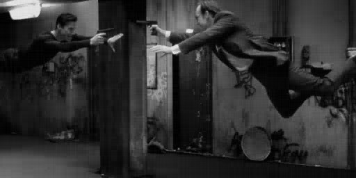

# Chapter 06

# 기저 - Basis

## 6.1 좌표계 - Coordinate system

### 6.1.1 데카르트의 생각


1618년 프랑스의 수학자 르네 데카르트(René Descartes)는 기하학을 접근하는 방식을 완전히 바꾼 개념을 발견하였다. 일화에 따르면 데카르트는 침대에 누워 방의 천장 모서리 주위를 날고 있는 파리를 보고 있다가 기하학에 대한 훌륭한 생각이 떠올랐다고 한다. *(역시 천재는 생각하는 자체가 다른듯...)* 데카르트는 파리의 위치는 두 개의 숫자, 즉 파리 근처 두 개의 벽으로부터 파리까지의 거리로 기술할 수 있다는 것을 깨달았고,  두 벽이 수직이 아니라도 이것이 사실이라는 것을 알게 되었다. 또한 데카르트는 기하학적 분석을 대수적으로 접근할 수 있음을 알게 되었다. *(엄청나다...)* 


### 6.1.2 좌표표현 - Coordinate representation

위에서 얘기한 파리의 위치를 특정하는 두 개의 숫자를 *좌표(Coordinates)* 라고 한다. 벡터공간 $\mathcal{V}$ 에 대한 *좌표계* 는 $\mathcal{V}$ 의 생성자([4.2.3 참고](http://nbviewer.jupyter.org/github/ExcelsiorCJH/Study/blob/master/LinearAlgebra/CodingTheMatrix/Chap04%20-%20The%20Vector%20Space/Chap04-The_Vector_Space.ipynb)) $a_1, ..., a_n$에 의해 명시된다. $\mathcal{V}$ 내의 모든 벡터 $v$는 아래와 같이 생성자의 선형결합으로 나타낼 수 있다.

$$v = \alpha_1 a_1 + \cdots + \alpha_n a_n$$

따라서, $v$는 계수들의 벡터 $[\alpha_1, ..., \alpha_n]$ 에 의해 나타낼 수 있다. 이러한 계수들을 *좌표* 라 하고 벡터 $[\alpha_1, \cdots , \alpha_n]$ 은 $a_1, ..., a_n$ 에 대한 $v$ 의 *좌표표현* 이라고 한다. <br />

하지만 점에 대한 좌표 할당만으로는 충분하지 않다. 각 점에 대한 좌표 할당은 정확하게 한 가지 방식으로 이루어 져야 한다. 이를 위해서는 생성자 $a_1, ..., a_n$를 잘 선택해야 한다. 이 부분은 [6.7.1 좌표표현의 존재와 유일성]()에서 설명할 것이다. <br />

***Example 6.1.1*** : 벡터 $v=[1, 3, 5, 3]$은 $1[1,1,0,0]+2[0,1,1,0]+3[0,0,1,1]$ 와 동일하다. 따라서 $v$의 벡터 $[1,1,0,0],[0,1,1,],[0,0,1,1]$ 에 대한 좌표표현은 $[1, 2, 3]$ 이다.

***Example 6.1.3*** : $GF(2)$ 상의 벡터에 대해 알아보자. 벡터 $[0,0,0,1]$ 이 벡터 $[1,1,0,1],[0,1,0,1],[1,1,0,0]$에 대한 좌표표현은 아래와 같다.

$$[0,0,0,1] = 1[1,1,0,1] + 0[0,1,0,1] + 1[1,1,0,0]$$

따라서, $[0,0,0,1]$의 좌표표현은 $[1,0,1]$ 이다.


### 6.1.3 좌표표현과 행렬-벡터 곱셈

좌표를 왜 벡터로 나타낼까? 좌표표현을 행렬-벡터 및 벡터-행렬 곱셈의 선형결합 정의의 관점에서 보도록 하자.  좌표축이 $a_1,...,a_n$ 이라고 하고, 이 좌표축을 열벡터로 보고, 행렬 $A$를 나타내면 $A =\begin{bmatrix}  &  &  \\ a_1 & \cdots & a_n \\  &  &  \end{bmatrix} $ 로 나타낼 수 있고, 이 행렬의 열들은 생성자를 나타낸다. 

- "$u$ 는 $a_1, ..., a_n$ 에 대한 $v$ 의 좌표표현이다." 라는 것을 행렬-벡터 방정식으로 다음과 같이 쓸 수 있다.

$$Au = v$$

- 그러므로, 좌표표현 $u$ 에서 표현할 벡터를 나타내려면 $A$와 $u$를 곱한다.
- 또한, 벡터 $v$ 에서 그 좌표표현을 얻으려면 행렬-벡터 방정식 $Ax = v$ 를 풀면 된다. $A$ 의 열들은 $\mathcal{V}$ 에 대한 생성자들이고 $v$ 는 $\mathcal{V}$에 속하므로 방정식은 적어도 하나의 해를 가져야 한다.


## 6.2 손실압축(Lossy compression) 들여다 보기

좌표표현의 한 가지 응용으로 손실압축에 대해 알아보자. 예를 들어 많은 수의 $2000 \times 1000$ 흑백이미지를 저장한다고 하면, 이러한  이미지는 $D$-벡터에 의해 표현될 수 있다. 여기서 $D=\{0,1,...,1999\} \times \{0,1,...,999\}$ 이다. 이러한 흑백이미지를 컴팩트하게 (compactly) 저장한다고 할 때 다음과 같은 3가지 방안을 생각해 볼 수 있다. 

### 6.2.1 Strategy 1: 벡터를 가장 가까운 스파스 벡터로 대체하기

벡터를 가장 가까운 $k$-스파스 벡터로 대체하는 것을 생각해보자. 이러한 압축 방법은 원래의 이미지 정보에 대한 손실이 있으므로 *손실압축* 이라고 한다. 아직까지는 벡터들 사이의 거리를 구하는 방법을 배우지 않았으므로 단순하게 이미지의 픽셀에서 값의 크기가 큰 $k$개의 원소를 제외한 나머지 원소를 모두 $0$ 으로 대체하여 압축할 수 있다. 아래의 예제는 매트릭스 영화의 한 장면을 $k$-Sparse로 압축한 예제이다. 

***Example 6.2.2*** : 

```python
# 이미지 파일 불러오기
img = Image.open('./images/img01.png')
img = img.convert('L')
img = np.asarray(img, dtype='float32')
print(img.shape)  # (256 x 512) 이미지 행렬

min_img_top10p = min(sorted(img.reshape(-1).tolist(), reverse=True)[:13108])  # = 92
# k-sparse 이미지 행렬 만들기
# 상위 10%를 제외한 나머지 값은 0으로 대체하기
img_sparse = [pix  if pix >= min_img_top10p else 0 for pix in img.reshape(-1).tolist()]
img_sparse = np.array(img_sparse)
# 원래의 이미지 행렬로 바꿔주기
img_sparse = img_sparse.reshape(256, -1)
print(img_sparse.shape)

fig, axs = plt.subplots(1, 2, figsize=(25, 5))
fig.subplots_adjust(hspace = .5, wspace=.5)

img_list = [img, img_sparse]
title_list = ['original', 'sparse']

for i, img in enumerate(img_list):
    axs[i].imshow(img ,cmap='Greys_r')
```

위의 결과 이미지는 많은 개수의 픽셀이 $0$ 으로 대체되기 때문에 원래의 이미지와 많이 다르다. 


### 6.2.2 Strategy 2: 이미지 벡터를 좌표표현으로 표현하기

또 다른 방법은 원래의 이미지에 fidelity를 없애는 것이다. 

- 이미지를 압축하려고 하기 전에 벡터들의 컬렉션 $a_1, ..., a_n$ 을 선택한다. 
- 다음에, 각 이미지 벡터에 대해 그 벡터의 $a_1, ..., a_n$에 대한 좌표표현 $u$를 찾아 그것을 저장한다. 
- 좌표표현으로부터 원래 이미지를 복원하기 위해 대응하는 선형결합을 계산한다. 

하지만 이 방법은 $2000 \times 1000$ 이미지 벡터가 $a_1, ..., a_n$ 의 선형결합으로 표현될 수 있어야 한다. 즉, $\mathbb{R}^D=Span \{a_1,...,a_n\}$ 이어야 한다.  따라서, 위를 만족하는 벡터들의 수는 적지 않아 압축을 하기에는 무리가 있다. (Example 6.2.3 참고)


### 6.2.3 Strategy 3: 하이브리드 방식

앞의 두 방안(Strategy1, 2) 좌표표현과 가장 가까운 $k$-스파스 벡터를 결합하는 방법이 있다. 

- *Step 1* : 벡터 $a_1,..., a_n$ 을 선택한다.
- *Step 2* : 압축하고자 하는 각 이미지에 대해, 대응하는 벡터 $v$ 를 정하고, $a_1,...,a_n$ 에 대한 좌표표현 $u$를 찾는다.
- *Step 3* : 다음에, $u$ 를 가장 가까운 $k$-스파스 벡터 $\tilde{u}$ 로 대체한다.
- *Step 4* : $\tilde{u}$ 로 부터 원래 이미지를 복원하기 위해 $a_1,...,a_n$ 의 대응하는 선형결합을 계산한다. 

*Step 1* 에서 벡터 $a_1,...,a_n$을 선택하는 방법은 11장에서 다룬다. 따라서, 11장 까지 배우고 난 다음 다시 풀도록 하겠다.. ㅜㅜ <br />

이 방법으로 압축하면 아래와 같은 결과를 얻을 수 있다고 한다.




## 6.3 생성자 집합을 찾기 위한 두 개의 Greedy 알고리즘

이번 절에서는 아래의 물음의 답을 찾기 위한 두 개의 알고리즘을 고려해 본다.

*주어진 벡터공간 $\mathcal{V}$에 대해 $Span$ 이 $\mathcal{V}$ 와 동일하게 되는 최소 개수의 벡터들은 무엇인가?*

### 6.3.1 Grow 알고리즘

위의 질문에서 어떻게 최소 개수의 벡터들을 구할 수 있을까? 라는 질문에 생각할 수 있는 방법은 *Grow* 알고리즘과 *Shrink* 알고리즘이 있다. 먼저 Grow 알고리즘에 대해 알아보자. <br />

Grow 알고리즘은 특별한 알고리즘이 아니라 벡터를 추가하다가 더이상 추가할 벡터가 없을 때, 종료되는 알고리즘을 의미한다. (*소제목이 Grow 알고리즘이길래 대단한 알고리즘인 줄 알았다는...*) Grow 알고리즘을 의사코드(pseudocode)로 나타내면 다음과 같다.

```
def Grow(V)
	B = 0
	repeat while possible:
		find a vector v in V that is not in Span B, and put it in B
```

위에서 설명한 대로 이 알고리즘은 더이상 추가할 벡터가 없을 때, 즉, $B$ 가 $\mathcal{V}$ 의 $Span$ 일 때 종료된다. <br />

***Example 6.3.1*** : $\mathbb{R}^3$ 에 대한 생성자들의 집합을 선택하는 데 Grow 알고리즘을 사용해 보자. [4.2.5 표준생성자](http://nbviewer.jupyter.org/github/ExcelsiorCJH/Study/blob/master/LinearAlgebra/CodingTheMatrix/Chap04%20-%20The%20Vector%20Space/Chap04-The_Vector_Space.ipynb)에서 $\mathbb{R}^n$에 대한 표준 생성자에 대해 알아보았다. Grow 알고리즘을 사용하면 첫 번째 이터레이션(iteration)에서 집합 $B$에 $[1,0,0]$ 추가한다. 그런다음 $[0,1,0]$ 은 $Span \{[1,0,0]\}$에 포함되지 않으므로 $[0,1,0]$을 추가한다. 마지막으로 $[0,0,1]$을 $B$ 에 추가한다. 임의의 벡터 $v=[\alpha_1, \alpha_2, \alpha_3] \in \mathbb{R}^3$ 은 아래와 같이  선형결합으로 나타낼 수 있으므로 $Span (e_1, e_2, e_3)$ 내에 있다. 

$$v = \alpha_1 e_1 + \alpha_2 e_2 + \alpha_3 e_3$$

그러므로 $B$ 에 추가할 벡터 $v \in \mathbb{R}^3$ 는 더이상 없기 때문에 Grow 알고리즘은 종료된다.


### 6.3.2 Shrink 알고리즘

이번에는 Grow 알고리즘과는 반대라고 할 수 있는 Shrink 알고리즘에 대해 알아보자. 

```
def Shrink(V)
	B = some finite set of vectors that span V
	repeat while possible:
		find a vector v in B such taht Span (B - {v}) = V, and remove v from B
```

위의 의사코드에서 알 수 있듯이 Shrink 알고리즘은 Span 집합에서 더이상 제거할 벡터가 없을 때 종료된다. 아래의 예제를 보자. <br />

***Example 6.3.2*** : 처음 집합 $B$는 아래와 같은 벡터들로 구성되어있다고 하자.

$$\begin{matrix} v_1 & = & [1,0,0] \\ v_2 & = & [0,1,0] \\ v_3 & = & [1,2,0] \\ v_4 & = & [3,1,0] \end{matrix}$$

$v_4 = 3v_1 + v_2$ 이므로, 첫 번째 이터레이션에 $B$ 에서 $v_4$를 제거한다. 두번 째 이터레이션에서 $v_3 = v_1 + 2v_2$ 이므로 $B$ 에서 $v_3$를 제거한다.  따라서 $B = \{v_1, v_2\}$ 가 되고 Span$B = \mathbb{R}^2$ 이 되며, 알고리즘은 종료된다. 


*6.4* 생략

## 6.5 선형(일차)종속 - Linear dependence

### 6.5.1 Superfluous-Vector 보조정리

앞의 6.3 절에서 Grow 와 Shrink 알고리즘에 대해 알아보았다. 이 알고리즘을 더 잘 이해하기 위해서는 *Span* 을 변경하지 않고 생성자들의 집합에서 벡터를 제거하는 것이 어떻게 가능한지 알아볼 필요가 있다. Superfluous 는 사전적 의미로 *더이상 필요치 않은* 이라는 의미이다. 아래의 Lemma 를 보자. <br />

***Lemma (Superfluous-Vetor Lemma)*** : 임의의 집합 $S$ 와 임의의 벡터 $v \in S$ 에 대해, 만약 $v$가 $S$ 내의 다른 벡터들의 선형결합으로 표현될 수 있으면, Span ($S-\{v\}$) = Span $S$ 이다. 

-  **Proof** : $S = \{v_1, …, _n\}$ 이라 하고, $v_n$ 은 다음과 같다고 하자.

$$v_n = \alpha_1 v_1 + \alpha_2 v_2 +\cdots + \alpha_{n-1} v_{n-1}$$

- 이때, Span $S$ 내의 모든 벡터는 Span $(S - \{v\})$ 내에 있음을 보여 주려고 한다. Span $S$ 내의 모든 벡터 $v$ 는 아래와 같이 표현할 수 있다.

$$v = \beta_1 v_2 + \cdots + \beta_n v_n$$

- 위의 $v_n$ 식을 $v$ 에 대입하면 다음과 같다.

$$\begin{matrix} v & = & \beta_1 v_1 + \beta_2 v_2 + \cdots +\beta_n (\alpha_1 v_1 + \alpha_2 v_2 + \cdots +\alpha_{n-1} v_{n-1}) \\  & = & (\beta_1 + \beta_n \alpha_1)v_1 + (\beta_2 + \beta_n \alpha_2)v_2 + \cdots + (\beta_{n-1} + \beta_n \alpha_{n-1})v_{n-1} \end{matrix}$$

- 위의 식은 Span $S$ 내의 임의의 벡터는 $S - \{v_n\}$ 내 벡터들의 선형결합으로 표현될 수 있고, 따라서 Span ($S - \{v_n\}$) 내에 있다는 것을 알 수 있다. 


### 6.5.2 일차종속 정의하기

 ***Definition*** : 벡터 $v_1,…,v_n$ 에 대해 

$$\alpha_1 v_1 + \cdots + \alpha_n v_n = 0$$ 

을 만족하는 영벡터($0$) 가 아닌 $\alpha_1, …, \alpha_n$ 이 존재할 경우 이러한 선형결합을 $v_1,...,v_n$의 *__선형종속__(일차종속, Linear dependence)* 이라고 한다.  <br />

반대로, $\alpha_1, …, \alpha_n$가 유일하게 영벡터(0)를 해로 가질 때 즉, 자명한(trivial) 선혀결합일 경우 $v_1,...,v_n$ 은 *__선형독립__(일차독립, Linear Independence)* 이라고 한다. <br />

***Example 6.5.3*** : 벡터 $[1,0,0], [0,2,0], [2,4,0]$ 은 아래의 식과 같이 선형종속이다.

$$2[1,0,0]+2[0,2,0]-1[2,4,0]=[0,0,0]$$

***Example 6.5.4*** : 벡터 $[1,0,0], [0,2,0], [0,0,4]$ 는 아래의 식과 같이 $\alpha_1, \alpha_2, \alpha_3 = 0$ 인 선형독립이다. 그 이유는 각 벡터는 다른 벡터들이 영(0)을 가지는 위치에 영이 아닌 원소를 가지기 때문이다.

$\alpha_1 [1,0,0] + \alpha_2 [0,2,0] + \alpha_3 [0,0,4]=[0,0,0]$

<br />

6.5.3 생략

### 6.5.4 일차독립 및 종속의 성질

***Lemma*** : 선형독립(일차독립)의 부분집합은 선형독립(일차독립)이다.

- **Proof** : $S$ 와 $T$ 는 벡터들의 부분집합이라 하고, $S$ 는 $T$ 의 부분집합($S \subset T$) 라하자. 증명하고자 하는 것은 $T$ 가 선형독립이면 $S$ 는 선형독립이라는 것이다. 이것은 $S$ 가 선형종속이면 $T$ 는 선형종속이라는 대우명제와 동일한 명제이다. 
- $T=\{s_1,…,s_n,t_1,…,t_k\}, S=\{s_1,…,s_n\}$ 이라고 하고, $S$는 선형종속이라고 가정하자. 그럴 경우, 영(0)이 아닌 다음식을 만족하는 계수 $\alpha_1,...,\alpha_n$ 이 존재한다.

$$\alpha_1 s_1 + \cdots + \alpha_n s_n = 0$$

- 그러므로, 

$$\alpha_1 s_1 + \cdots + \alpha_n s_n + 0t_1 + \cdots + 0t_k = 0$$

- 위의 식을 통해 영벡터는 자명하지 않는 선형결합 즉, 선형종속이라는 것을 보여준다.

<br />

***Lemma (Span Lemma)*** : $v_1,…,v_n$ 은 벡터들이라고 하면, 벡터 $v_i$ 가 다른 벡터들의 Span 내에 있을 필요충분조건은 영벡터가 $v_1,...,v_n$의 선형결합으로 표현될 수 있으며 $v_i$의 계수가 영이 아닌 것이다. 

-  **Proof** : 위의 Lemma 를 증명하는 방법은 두가지 방법이 있다. 

- 먼저, 첫 번째 방법은 $v_i$ 는 다른 벡터들의 Span 내에 있다고 하면, 다음을 만족하는 계수 $\alpha_1, ..., \alpha_{n-1}$ 이 존재한다.

  $$v_i = \alpha_1 v_1 + \cdots + \alpha_{i-1} v_{i-1} + \alpha_{i+1} v_{i+1} + \cdots + \alpha_n v_n$$ 

- $v_i$ 를 우변으로 옮기면 다음을 얻는다.

  $$0 = \alpha_1 v_1 + \cdots + (-1)v_i + \cdots + \alpha_n v_n$$

- 두 번째 방법은 다음 식을 만족하는 계수 $\alpha_1, ..., \alpha_{n}$ 이 존재하고

$$0 = \alpha_1 v_1 + \cdots + \alpha_i v_i + \cdots + \alpha_n v_n$$

- $\alpha \neq 0$ 이라고 하면, 양변에 $\alpha_i v_i$ 를 빼고 $-\alpha_i$ 로 나누면 다음과 같다.

$$1v_i = (\alpha_1 / -\alpha_i)v_i + \cdots + (\alpha_{i-1}/ -\alpha_i)v_{i-1} + (\alpha_{i+1}/-\alpha_i)v_{i+1} + \cdots + (\alpha_n / -\alpha_i)v_n$$


6.5.5 - 6.5.6 생략

## 6.6 기저 - Basis

### 6.6.1 기저 정의하기

***Definition*** : $\mathcal{V}$ 는 벡터공간이라고 하면 $\mathcal{V}$ 에 대한 *기저(basis)* 는 $\mathcal{V}$ 에 대한 생성자들로 구성된 선형독립 집합이다.  <br />

따라서, $\mathcal{V}$ 의 벡터들의 집합 $B$는 다음 두 성질을 만족하면 $\mathcal{V}$ 에 대한 *기저* 이다.

- **Property B1** ***(Spanning)*** : Span $B = \mathcal{V}$ 이다.
- ***Property B2 (Independent)*** : $B$ 는 선형(일차)독립이다.


***Example 6.6.2*** : $\mathcal{V}$ 는 $[1,0,2,0],[0,-1,0,-2], [2,2,4,4]$ 에 의해 생성된 벡터공간이라 정의하자. 집합 $\{[1,0,2,0],[0,-1,0,-2], [2,2,4,4]\}$ 은 아래와 같이 선형독립이 아니므로 $\mathcal{V}$ 에 대한 기저가 아니다. 

$$1[1,0,2,0]-1[0,-1,0,-2]-\frac{1}{2} [2,2,4,4]=0$$

하지만, 집합 $\{[1,0,2,0],[0,-1,0,-2]\}$ 은 기저이다. 

- 위의 두 벡터는 각각 다른 벡터가 영(0)을 가지는 위치에 영이 아닌 원소를 가지므로 선형독립이다. 
- 위의 두 벡터는 $\mathcal{V}$ 를 생성한다. 6.5.1에서 Superfluous-Vector Lemma 에 의하면 $\mathcal{V}$ 의 세 번째 벡터 $[2,2,4,4]$ 는 아래와 같이 첫두 벡터의 선형결합으로 표현할 수 있으므로 없어도 된다.

$$[2,2,4,4] = 2[1,0,2,0] - 2[0,-1,0,-2]$$

***Example 6.6.3*** : 또한, $\{[1,0,2,0],[2,2,4,4]\}$ 는 동일한 벡터공간 $\mathcal{V}$ 에 대한 기저이다.  <br />

***Example 6.6.6*** : 영벡터로만 구성된 벡터공간은 기저를 가질까? 그에 대한 답은 기저는 공집합이다. 공집합의Span, 즉 Span $\{\emptyset \}$ 은 영벡터로 구성된 집합이다. 따라서, 공집합의 모든 선형결합에 대해 영이 아닌 계수는 존재하지 않으므로 기저를 가진다.


### 6.6.2 $F^D$ 에 대한 표준 기저

[4.2.5 표준 생성자](http://nbviewer.jupyter.org/github/ExcelsiorCJH/Study/blob/master/LinearAlgebra/CodingTheMatrix/Chap04%20-%20The%20Vector%20Space/Chap04-The_Vector_Space.ipynb) 에서 $F^D$ 에 대한 생성자들의 집합인 표준 생성자들에 대해 알아보았다. 이러한 생성자들은 $F^D$ 에 대한 **표준 *기저 벡터*** (Standard basis) 라고 한다. <br />

***Lemma*** : $F^D$ 에 대한 표준 생성자들은 기저를 형성한다. <br />

예를 들어, $\mathbb{R}^3$의 표준 생성자들에 의한 기저 집합은 $\{[1,0,0],[0,1,0],[0,0,1]\}$ 이고 이 세 벡터를 표준 기저 벡터라고 한다. <br />

6.6.3 생략


### 6.6.4 생성에 대한 기저를 포함하는 벡터들의 임의의 유한집합

***Lemma(Subset-Basis Lemma)*** : 벡터들로 구성된 임의의 유한집합 $T$ 는 Span $T$ 에 대한 기저인 부분집합 $B$ 를 포함한다. <br />

***Example 6.6.12*** : $T = \{[1,0,2,0],[0,-1,0,-2],[2,2,4,4]\}$ 라고 하자. 다음 프로시저는 Span $T$ 에 대한 기저인 부분집합 $B$를 찾아야 한다. 앞에서 다룬 *Grow* 알고리즘을 이용해 예제를 풀어보자

- $B = \emptyset$ 으로 초기화 한다.
- Span $\{\emptyset \}$ 내에 있지 않은 $T$ 의 벡터를 선택하여 그것을 $B$ 에 추가한다. Span $\{\emptyset \}$은 영벡터만으로 구성되어 있으므로 선택된 첫 번째 벡터는 영이 아니어야 한다. $[1,0ㅡ2ㅡ0]$ 이 선택됐다고 하자.
- Span $\{[1,0,2,0]\}$ 에 들어있지 않은 $T$ 의 벡터 $[0,-1,0,-2]$를 선택했다고 가정하자.
- Span $\{[1,0,2,0],[0,-1,0,-2]\}$ 내에 들어 있지 않은 $T$ 의 벡터를 선택하자. 하지만, Span $\{[1,0,2,0],[0,-1,0,-2]\}$ 으로 $T$ 의 모든 벡터를 나타낼 수 있으므로 Span $\{[1,0,2,0],[0,-1,0,-2]\}$ 에 존재 하지 않는 벡터는 없다. 따라서 프로시저는 종료된다.

