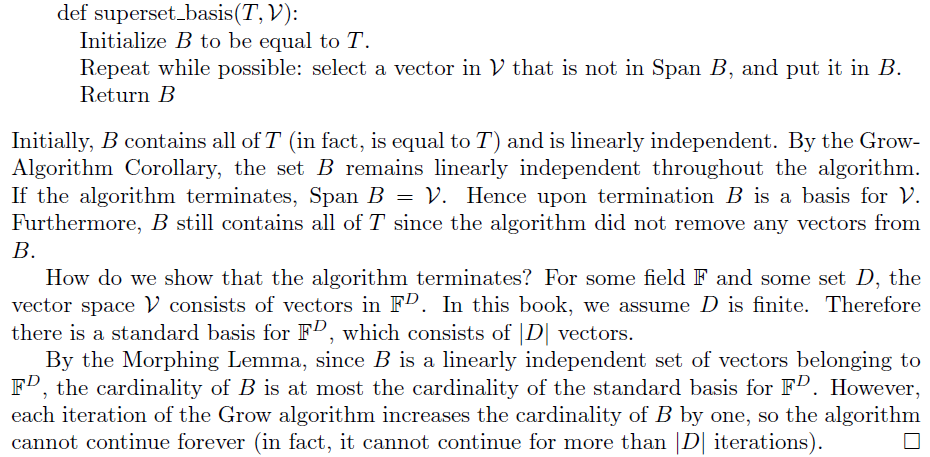

# Chap 07

# 차원 - Dimension

## 7.1 기저의 크기

### 7.1.1 Morphing 보조 정리와 그 응용

***Lemma (Morphing Lemma)*** : $\mathcal{V}$ 는 벡터공간이라고 하자. $S$ 는 $\mathcal{V}$ 에 대한 생성자들의 집합이라 하고, $B$ 는 $\mathcal{V}$ 에 속하는 벡터들로 구성된 선형독립인 집합(즉, 기저)이라고 하면, $|S| \ge |B|$ 이다.   

***Theorem (Basis Theorem)*** : $\mathcal{V}$ 는 벡터공간이라 하고, $\mathcal{V}$ 에 대한 모든 기저(basis)는 동일한 크기를 가진다.

- **Proof** : $B_1$ 과 $B_2$ 는 $\mathcal{V}$ 에 대한 두 기저라고 하자. $S=B_1$ 과 $B=B_2$ 를 위의 *Morphing Lemma* 에 적용하면 $|B_1| \ge |B_2|$ 라고 할 수 있다. $S = B_2$ 와 $B=B_1$ 을 적용하면 $|B_2| \ge |B_1|$ 이다. 이 둘의 부등식을 결합하면 $|B_1| = |B_2|$ 를 얻을 수 있다. 

***Theorem*** : $\mathcal{V}$ 는 벡터공긴이라고 하면, $\mathcal{V}$ 에 대한 생성자들의 집합이 $\mathcal{V}$ 에 대한 생성자들로 구성된 *가장 작은 집합* 이 되는 필요충분 조건은 이 집합이 $\mathcal{V}$ 에 대한 기저인 것이다.

- **Proof** : $T$ 는 $\mathcal{V}$ 에 대한 생성자들의 집합이라고 하자. 그렇다면, 증명해야 하는 것은 
  - (1) 만약 $T$ 가 $\mathcal{V}$ 에 대한 기저이면 $T$ 는 $\mathcal{V}$ 에 대한 생성자들로 구성된 가장 작은 집합이다.
  - (2) 만약 $T$ 가 $\mathcal{V}$ 에 대한 기저가 아니면 생성자들로 구성된 $T$ 보다 더 작은 집합이 존재한다.

1. $T$ 를 기저라고 하고, $S$ 는 $\mathcal{V}$ 에 대한 생성자들로 구성된 가장 작은 집합이라고 하자. 위의 *Morphing Lemma* 에 의하면, $|T| \le |S|$ 이고, 따라서 $T$ 또한 생성자들의 가장 작은 집합이다.
2. $T$ 는 기저가 아니라고 해보자. 기저는 *생성자들로 구성된 선형독립* 인 집합이다. 그러므로 $T$ 는 기저가 아니라 했으니, $T$ 는 생성자들로 구성된 선형종속인 집합이다.  [6.5.4의 Lemma](http://nbviewer.jupyter.org/github/ExcelsiorCJH/Study/blob/master/LinearAlgebra/CodingTheMatrix/Chap06%20-%20The%20Basis/Chap06-The_Basis.ipynb#6.5.4-일차독립-및-종속의-성질)에 따르면 $T$ 내에 다른 벡터들의 생성에 속하는 일부 벡터들이 있다. 그러므로 *[Superfluous-Vector Lemma](http://nbviewer.jupyter.org/github/ExcelsiorCJH/Study/blob/master/LinearAlgebra/CodingTheMatrix/Chap06%20-%20The%20Basis/Chap06-The_Basis.ipynb#6.5.1-Superfluous-Vector-보조정리)* 에 의해, $T$ 에서 제거하면 $\mathcal{V}$ 에 대한 생성자들의 집합이 되는 일부 벡터가 존재한다. 따라서 $T$ 는 생성자들로 구성된 가장 작은 집합이 아니다.

*7.1.2 생략*

## 7.2 차원과 랭크 - Dimension and Rank

### 7.2.1 정의 및 예제

***Definition*** : 벡터공간의 *차원* 은 그 벡터공간에 대한 기저의 크기로 정의한다.  벡터공간 $\mathcal{V}$ 의 차원은 $\dim \mathcal{V}$ 로 표현한다.  

- ***Example 7.2.2*** : $\mathbb{R}^3$ 에 대한 하나의 기저는 표준 기저 $\{[1,0,0],[0,1,0],[0,0,1]\}$ 이다. 그러므로 $\mathbb{R}^3$ 의 차원은 기저의 크기인 3, 즉 $\dim \mathcal{V}=3$ 이다. 
- ***Example 7.2.3*** : 좀 더 일반적으로, 임의의 필드 $F$ 와 유한집합 $D$ 에 대해, $F^D$ 에 대한 하나의 기저는 표준기저이고 이것은 $|D|$ 벡터들로 구성되므로, $F^D$의 차원은 $|D|$ 이다.

 

***Definition*** : 벡터들의 집합 $S$ 의 랭크(rank)를 Span $S$ 의 차원이라 정의한다. $S$ 의 랭크는 rank $S$ 로 나타낸다.

- ***Example 7.2.6*** : 벡터 $[1, 0, 0], [0,2,0],[2,4,0]$ 은 선형종속이다. 그러므로 이 벡터들의 랭크는 $3$보다 작다. 이들 중 임의의 두 벡터는 세 벡터들의 Span에 대한 기저를 형성한다. 따라서 랭크는 $2$ 이다.

 

***Proposition*** : 벡터들로 구성된 임의의 집합 $S$ 에 대해, rank $S \le |S|$   

***Definition*** : 행렬 $M$에 대해, $M$ 의 *행랭크* 는 그 행렬의 행의 랭크이고, $M$ 의 *열랭크* 는 그 행렬의 열의 랭크이다. 즉, $M$의 행랭크는 Row $M$의 차원이고, $M$ 의 열랭크는 Col $M$의 차원이다.

- ***Example 7.2.10*** : 

$$
M=\begin{bmatrix} 1 & 0 & 0 \\ 0 & 2 & 0 \\ 2 & 4 & 0 \end{bmatrix}
$$

- 이 행렬의 행벡터는 $[1,0,0],[0,2,0],[2,4,0]$ 이고, 위의 Example 7.2.6 에서 살펴보았듯이 행벡터의 랭크는 $2$이므로, $M$의 행랭크는 $2$이다.

- 행렬 $M$의 열벡터는 $[1,0,2],[0,2,4],[0,0,0]$ 이다. 세 번째 벡터는 영벡터이므로, 열공간을 생성하는 데 필요하지 않다. 나머지 두 벡터는 선형독립이므로 열랭크는 $2$ 이다.

 

- ***Example 7.2.11*** :

$$
M=\begin{bmatrix} 1 & 0 & 0 & 5 \\ 0 & 2 & 0 & 7 \\ 0 & 0 & 3 & 9 \end{bmatrix}
$$

- 행벡터 $[1,0,0,5],[0,2,0,7],[0,0,3,9]$ 들은 선형독립이므로 $M$의 행랭크는 $3$ 이다.
- $M$의 열벡터 $[1,0,0],[0,2,0],[0,0,3],[5,7,9]$ 들은 처음 세 열은 선형독립이고 $[5,7,9]$ 은 앞의 세 벡터의 선형결합으로 나타낼 수 있으므로 열랭크는 $3$이다.

 

위의 두 예제를 통해 행랭크와 열랭크가 동일하다는 것을 알 수 있다. 이것은 우연히 동일한 것이 아니라, 어떤 행렬에 대해서도 *행랭크* 와 *열랭크* 가 *동일* 하다.

### 7.2.2 기하학적 구조

좌표계에 대해 기하학적으로 이해 해보자. 기하적 객체의 차원은 객체의 점들에 할당되어야 하는 최소 개수의 좌표이다. 좌표의 수는 기저의 크기이고, 기저의 크기는 주어진 벡터들로 구성된 집합의 랭크이다. 

- Span $\{[1,2,-2]\}$ 은 직선, 즉 1차원 객체이다.  Span $\{[0,0,0]\}$ 은 점, 즉 1차원 구조이다. 첫 번째 벡터공간은 차원이 $1$이고 두 번째 벡터공간은 차원이 $0$이다.
- Span $\{[1,2],[3,4]\}$ 은 $\mathbb{R}^2$의 모든 것, 즉 2차원 객체를 구성한다. 반면, Span $\{[1,3],[2,6]\}$ 은 직선, 즉 1차원 객체이다. 
- Span $\{[1,0,0],[0,1,0],[0,0,1]\}$ 은 $\mathbb{R}^3$ 의 모든 것, 즉 3차원 객체이다. 반면에, Span $\{[1,0,0],[0,1,0],[1,1,0]\}$ 은 평면 즉, 2차원 객체이다.

 

*7.2.3 생략*

### 7.2.4 $GF(2)$ 상의 벡터공간의 크기

$d$ 는 $GF(2)$ 상의 벡터공간 $\mathcal{V}$ 에 대한 차원이라 하고, $b_1,...,b_d$는 $\mathcal{V}$ 에 대한 기저라고 하면,  [6.7.1의 Unique Representation Lemma](https://render.githubusercontent.com/view/ipynb?commit=0febde811f1f71918c7f654959b434342137044e&enc_url=68747470733a2f2f7261772e67697468756275736572636f6e74656e742e636f6d2f457863656c73696f72434a482f53747564792f306665626465383131663166373139313863376636353439353962343334333432313337303434652f4c696e656172416c67656272612f436f64696e675468654d61747269782f4368617030362532302d25323054686525323042617369732f4368617030362d5468655f42617369732e6970796e62&nwo=ExcelsiorCJH%2FStudy&path=LinearAlgebra%2FCodingTheMatrix%2FChap06+-+The+Basis%2FChap06-The_Basis.ipynb&repository_id=116745719&repository_type=Repository#6.7.1-%EA%B8%B0%EC%A0%80%EB%A5%BC-%EC%82%AC%EC%9A%A9%ED%95%9C-%ED%91%9C%ED%98%84%EC%9D%98-%EC%9C%A0%EC%9D%BC%EC%84%B1)에 의해, $\mathcal{V}$ 내의 각 벡터는 기저벡터들의 선형결합으로 유일하게 표현된다. 따라서, $\mathcal{V}$ 내 벡터들의 수는 이 기저벡터들의 선형결합들의 수와 동일하다. $d$ 개의 기저벡터가 있으므로, 각 선형결합에는 $d$ 개의 계수가 있다. 각 계수는 $0$ 또는 $1$ 이므로 $2^d$ 개의 다른 선형결합이 있다.

### 7.2.5 $\mathcal{V}$ 에 속하는 벡터들의 임의의 선형독립 집합은 $\mathcal{V}$에 대한 기저를 형성하도록 확장될 수 있다.

***Lemma (Superset-Basis Lemma)*** : 임의의 벡터공간 $\mathcal{V}$와 벡터들로 구성된 임의의 선형독립 집합 $A$ 에 대해, $\mathcal{V}$는 $A$의 모든 원소를 포함하는 기저를 가진다.

- **Proof** : [6.3.1](https://render.githubusercontent.com/view/ipynb?commit=0febde811f1f71918c7f654959b434342137044e&enc_url=68747470733a2f2f7261772e67697468756275736572636f6e74656e742e636f6d2f457863656c73696f72434a482f53747564792f306665626465383131663166373139313863376636353439353962343334333432313337303434652f4c696e656172416c67656272612f436f64696e675468654d61747269782f4368617030362532302d25323054686525323042617369732f4368617030362d5468655f42617369732e6970796e62&nwo=ExcelsiorCJH%2FStudy&path=LinearAlgebra%2FCodingTheMatrix%2FChap06+-+The+Basis%2FChap06-The_Basis.ipynb&repository_id=116745719&repository_type=Repository#6.3.1-Grow-%EC%95%8C%EA%B3%A0%EB%A6%AC%EC%A6%98) 에서 보았던 Grow 알고리즘을 사용해보자.

 

### 7.2.6 차원 원리(Dimension principle)

***Lemma (Dimension Principle)*** : 만약 $\mathcal{V}$가 $\mathcal{W}$의 부분공간(subspace)이면, 다음 성질이 성립한다.

- *Property D1* : $\dim \mathcal{V} \le \dim \mathcal{W}$ 이다.
- *Property D2* : 만약 $\dim \mathcal{V} = \dim \mathcal{W}$ 이면 $\mathcal{V} = \mathcal{W}$ 이다.
  - **proof** : $v_1,...,v_k$ 는 $\mathcal{V}$에 대한 기저라고 하면, 7.2.5의 Superset-Basis Lemma에 의해 $v_1,...,v_k$를 포함하는 $\mathcal{W}$ 에 대한 기저 $B$가 있고, $B$의 크기는 적어도 $k$이다. 이 의미는 Property D1을 증명한다. 만약 $B$의 크기가 정확히 $k$이면 $B$는 $v_1,...,v_k$이외의 다른 벡터는 포함하지 않으며, $\mathcal{V}$의 기저는 $\mathcal{W}$의 기저임을 보여주어 Property D2를 증명한다.

 

- ***Example 7.2.15*** : $\mathcal{V}=Span \{[1,2],[2,1]\}$ 라고 해보자.  $\mathcal{V}$는 $\mathbb{R}^2$의 부분공간이다. 집합 $\{[1,2],[2,1]\}$ 은 선형독립이고, 따라서 $\dim \mathcal{V}=2$이다. $\dim \mathbb{R}^2=2$이므로 Property D2는 $\mathcal{V}=\mathbb{R}^2$ 임을 보여준다.
- ***Example 7.2.16*** : 집합$S = \{[-0.6,-2.1,-3.5,-2.2],[-1.3,1.5,-0.9,-0.5],[4.9,-3.7,0.5,-0.3],[2.6,-3.5,-1.2,-2.0],[-1.5,-2.5,-3.5,0.94]\}$에 대해 $|S|=5$ 이므로, $\dim $ Span $S \le 5$이다. $S$ 내의 모든 벡터는 $4$-벡터이므로, Span $S$는 $\mathbb{R}^4$의 부분공간이고, $\dim$ Span $S \le 4$ 이다.

 

위의 예제를 통해 다음을 알 수 있다.  

***Proposition*** : $D$-벡터들로 구성된 임의의 집합의 랭크는 $|D|$보다 작거나 같다.  

*7.2.7 생략*

### 7.2.8 Rank 정리

앞의 예제에서 살표보았듯이 행랭크와 열랭크는 동일하다. 이제 왜 행랭크와 열랭크가 같은지 알아보자.  

***Theorem (Rank Theorem)*** : 임의의 어떠한 행렬에 대해, 행랭크와 열랭크는 동일하다. 

- **Proof** : 임의의 행렬 $A$ 에 대해 $A$ 행랭크는 $A$의 열랭크보다 작거나 같다. 동일한 주장을 $A^T$ 에 적용하면 $A^T$의 행랭크는 $A^T$의 열랭크보다 작거나 같다. 즉, $A$의 열랭크는 $A$의 행랭크보다 작거나 같다. 이 두 부등식을 결합하면 $A$의 행랭크는 $A$의 열랭크와 동일하다.   $A$는 행렬이라 하자. 행렬 $A$를 열벡터로 나타내 보자: 

$$
A=\begin{bmatrix}  &  &  \\ a_{ 1 } & \cdots  & a_{ n } \\  &  &  \end{bmatrix}
$$

- $r$ 은 $A$ 의 열랭크라 하고 $b_1,…,b_r$ 은 $A$의 열공간에 대한 기저라 하자.  $A$ 의 각 열 $a_j$에 대해 $u_j$는 $a_j$의 $b_1,…,b_r$에 대한 좌표 표현이라 하자. 그러면, 행렬-벡터 곱셈의 선형결합 정의에 의해 다음과 같이 표현된다. 

$$
  \begin{bmatrix}  \\ a_{ j } \\  \end{bmatrix}=\begin{bmatrix}  &  &  \\ b_{ 1 } & \cdots  & b_{ r } \\  &  &  \end{bmatrix}\cdot \begin{bmatrix}  \\ u_{ j } \\  \end{bmatrix}
$$

- 행렬-행렬 곱셈의 행렬-벡터 정의에 의하면, 다음과 같이 표현되며,

$$
\begin{bmatrix}  &  &  \\ a_{ 1 } & \cdots  & a_{ n } \\  &  &  \end{bmatrix}=\begin{bmatrix}  &  &  \\ b_{ 1 } & \cdots  & b_{ r } \\  &  &  \end{bmatrix}\cdot \begin{bmatrix}  &  &  \\ u_{ 1 } & \cdots  & u_{ n } \\  &  &  \end{bmatrix}
$$

- 이것을 다음 처럼 쓸 수 있다. 

$$
A = BU
$$

- $B$는 $r$ 개의 열을 가지며 $U$는 $r$개의 행을 가진다.  이제, $A$ 와 $B$를 열 대신에 행들로 구성된 행렬로 생각해 보자.

$$
\begin{bmatrix}  & { \bar { a }  }_{ 1 } &  \\  & \vdots  &  \\  & { \bar { a }  }_{ m } &  \end{bmatrix}=\begin{bmatrix}  & { \bar { b }  }_{ 1 } &  \\  & \vdots  &  \\  & { \bar { b }  }_{ m } &  \end{bmatrix}\cdot U
$$

- 행렬-행렬 곱셈의 벡터-행렬 정의에 의하면, $A$의 행 $i$인 $\bar{a}_i$는 $B$의 행 $i$인 $\bar{b}_i$를 행렬 $U$에 곱한 것이다.

$$
\begin{bmatrix}  \\ \bar { a } _{ i } \\  \end{bmatrix}=\begin{bmatrix}  \\ \bar { b } _{ i } \\  \end{bmatrix}\cdot \begin{bmatrix}  &  &  \\  & U &  \\  &  &  \end{bmatrix}
$$

- 그러므로, 벡터-행렬 곱셈의 선형결합에 의하면 $A$의 모든 행은 $U$의 행들의 선형결합이다. 따라서, $A$의 행공간은 $U$의 행공간의 부분공간이다. $U$의 행공간의 차원은 $r$, 즉 $U$의 행의 수보다 작거나 같다. 따라서, $A$의 행랭크는 $r$ 보다 작거나 같다.   위에서 보았듯이, 임의의 행렬 $A$에 대해 $A$의 행랭크는 $A$의 열랭크보다 작거나 같다. 임의의 행렬 $M$에 대해, 이결과를 $M$에 적용하면 다음이 성립한다.

$$
rank(Row M)\le rank(ColM)
$$

- 이 결과를 $M^T$에 적용하면,

$$
rank(Row M^T) \le rank(ColM^T) \Longleftrightarrow rank(ColM) \le rank(RowM)
$$

- 따라서, $M$의 행랭크는 $M$의 열랭크와 동일하다.

***Definition*** : 행렬의 *랭크* 는 그 행렬의 열랭크와 동일하고, 이것은 또한 그 행렬의 행랭크와 같다.

## 7.3 직합 - Direct Sum 

### 7.3.1 정의

$\mathcal{U}$와 $\mathcal{V}$는 필드 $F$상의 $D$-벡터들로 구성된 두 개의 벡터공간이라고 하자.  

***Definition*** : 만약 $\mathcal{U}$ 와 $\mathcal{V}$ 가 오로지 영벡터만을 공유한다면 $\mathcal{U}$ 와 $\mathcal{V}$ 의 *직합* (direct sum)은 아래와 같이 정의하며,
$$
\{u + v : u \in \mathcal{U}, v \in \mathcal{V} \}
$$
$\mathcal{U} \oplus \mathcal{V}$ 로 나타낸다. 즉, $\mathcal{U} \oplus \mathcal{V}$ 는 $\mathcal{U}$의 벡터와 $\mathcal{V}$의 벡터의 모든 합으로 구성된 집합이다. 

- ***Example 7.3.3*** : $\mathcal{U}=$ Span $\{[1,2,1,2],[3,0,0,4]\}$ 라 하고, $\mathcal{V}$ 는 $\begin{bmatrix} 0 & 1 & -1 & 0 \\ 1 & 0 & 0 & -1 \end{bmatrix}$의 영공간([null space](https://render.githubusercontent.com/view/ipynb?commit=1159b38db70aaa50c569a142d417ce22079e5e6f&enc_url=68747470733a2f2f7261772e67697468756275736572636f6e74656e742e636f6d2f457863656c73696f72434a482f53747564792f313135396233386462373061616135306335363961313432643431376365323230373965356536662f4c696e656172416c67656272612f436f64696e675468654d61747269782f4368617030352532302d2532305468652532304d61747269782f4368617030352d5468655f4d61747269782e6970796e62&nwo=ExcelsiorCJH%2FStudy&path=LinearAlgebra%2FCodingTheMatrix%2FChap05+-+The+Matrix%2FChap05-The_Matrix.ipynb&repository_id=116745719&repository_type=Repository#5.7-%EC%98%81%EA%B3%B5%EA%B0%84---Null-space)) 이라 하자.  $\mathcal{U}$ 와 $\mathcal{V}$는 아래의 이유로,  $\mathcal{U} \oplus \mathcal{V}$ 가 성립하지 않는다.
  - 벡터 $[2, -2, -1, 2]$는 $[3,0,0,4]-[1,2,1,2]$ 이므로 $\mathcal{U}$ 내에 있다.
  - 벡터 $[2,-2,-1,2]$는 아래와 같이 $\mathcal{V}$ 내에 있다.

$$
\begin{bmatrix} 0 & 1 & -1 & 0 \\ 1 & 0 & 0 & -1 \end{bmatrix}\begin{bmatrix} 2 \\ -2 \\ -1 \\ 2 \end{bmatrix}=\begin{bmatrix} 0 \\ 0 \end{bmatrix}
$$

- ***Example 7.3.4*** : $\mathcal{U}=$ Span $\{[4,-1,1]\}$, $\mathcal{V}=$ Span $\{[0,1,1]\}$ 라고 하자. $\mathcal{U}$와 $\mathcal{V}$ 각각은 단일 벡터의 Span이고, 따라서 직선을 형성한다.  유일한 교점은 원점(0,0,0)이다. 따라서, $\mathcal{U} \oplus \mathcal{V}$는 성립한다. 이 직합은 Span $\{[4,-1,1],[0,1,1\}$ 이며 두개의 직선을 포함하는 평면이다.

 

***Proposition*** : 직합(direct sum) $\mathcal{U} \oplus \mathcal{V}$는 벡터공간이다.

### 7.3.2 직합에 대한 생성자

바로 위의 Example 7.3.4 에서, $\mathcal{U}$에 대한 생성자들의 집합과 $\mathcal{V}$에 대한 생성자들의 집합의 합집합을 구하면 직합 $\mathcal{U} \oplus \mathcal{V}$ 에 대한 하나의 생성자 집합이 얻어진다.   

***Lemma*** : 아래 집합의 합집합은

- $\mathcal{V}$의 생성자들의 집합
- $\mathcal{W}$의 생성자들의 집합

$\mathcal{V} \oplus \mathcal{W}$에 대한 생성자들의 집합이다.

- **proof** : $\mathcal{V}=$ Span $\{v_1,...,v_m\}$, $\mathcal{W}=$ Span $\{w_1,...,w_n\}$ 라고 하면,

  - $\mathcal{V}$ 내의 모든 벡터는 $\alpha_1 v_1 + \cdots + \alpha_m v_m$ 으로 표현할 수 있다.
  - $\mathcal{W}$ 내의 모든 벡터는 $\beta_1 w_1 + \cdots + \beta_n w_n$ 으로 표현할 수 있다.

  따라서, $\mathcal{V} \oplus \mathcal{W}$ 내의 모든 벡터는 다음과 같이 나타낼 수 있다.

$$
\alpha_1 v_1 + \cdots + \alpha_m v_m + \beta_1 w_1 + \cdots + \beta_n w_n
$$

### 7.3.3 직합에 대한 기저

***Lemma (Direct Sum Basis Lemma)*** : $\mathcal{U}$의 기저와 $\mathcal{V}$의 기저의 합집합은 $\mathcal{U} \oplus \mathcal{V}$ 의 기저이다.

- **Proof** : $\{u_1,...,u_m\}$은 $\mathcal{U}$에 대한 기저라 하고, $\{v_1,...,v_n\}$은 $\mathcal{V}$에 대한 기저라고 하면, 기저는 생성자들의 집합이므로, $\{u_1,...,u_m,v_1,...,v_n\}$은 $\mathcal{U} \oplus \mathcal{V}$에 대한 생성자들의 집합이다. 이제 기저라는 것을 보이기 위해서 *선형독립* 이라는 것을 보여주면 된다. 다음 식을 가정해보자.

$$
0 = \alpha_1 u_1 + \cdots + \alpha_m u_m + \beta_1 v_1 + \cdots + \beta_n v_n
$$

- 위의 식은 다음이 성립한다.

$$
\underbrace { \alpha _{ 1 }u_{ 1 }+\cdots +\alpha _{ m }u_{ m } }_{ in{ U } } =\underbrace { (-\beta_1)v_1 + \cdots + (-\beta_n)v_n }_{ in \mathcal{V} }
$$

- 좌변은 $\mathcal{U}$ 내의 벡터이고, 우변은 $\mathcal{V}$ 내의 벡터이다. $\mathcal{U} \oplus \mathcal{V}$ 의 정의에 의하면, $\mathcal{U}$ 와 $\mathcal{V}$ 둘 모두에 있는 유일한 벡터는 영벡터이다. 이것은 다음을 보여준다.

$$
0 = \alpha_1 u_1 + \cdots + \alpha_m u_m
$$

$$
0 = (-\beta_1)v_1 + \cdots + (-\beta_n)v_n
$$

- 위의 식들은 선형독립에 의해 자명하다(trivial).

 

위의 Lemma(Direct Sum Basis Lemma) 에 의해 다음과 같은 Corollary가 가능하다.

***Corollary (Direct-Sum Dimension Corollary)*** : $\dim \mathcal{U} + \dim \mathcal{V} = \dim \mathcal{U} \oplus \mathcal{V}$

위의 Corollary(따름정리)는 Kernel-Image Theorem을 증명하는데 사용할 것 이다.

### 7.3.4 벡터의 고유분해 - Unique Decomposition

***Corollary (Direct-Sum Unique Representation Collorary)*** : $\mathcal{U} \oplus \mathcal{V}$ 내의 임의의 벡터는 $u + v$ 로 유일하게 표현된다. (단,  $u \in \mathcal{U}, v \in \mathcal{V}$)

- **Proof** : $\{u_1,...,u_m\}$은 $\mathcal{U}$에 대한 기저라 하고, $\{v_1,...,v_n\}$은 $\mathcal{V}$에 대한 기저라고 하면,  $\{u_1,...,u_m,v_1,...,v_n\}$은 $\mathcal{U} \oplus \mathcal{V}$에 대한 기저이다.  $w$는 $\mathcal{U} \oplus \mathcal{V}$ 내의 임의의 벡터라고 하자. $w$는 다음과 같이 표현된다.

$$
w=\underbrace { \alpha _{ 1 }u_{ 1 }+\cdots +\alpha _{ m }u_{ m } }_{ in{ U } } +\underbrace { \beta_1 v_1 + \cdots + \beta_n v_n }_{ in \mathcal{V} }
$$

- $w$를 $w = u+v$로서 나타내는 방법을 고려해보자. $u$는 $\mathcal{U}$ 내에 있고, $v$는 $\mathcal{V}$ 내에 있다. $u$ 를 $\mathcal{U}$ 의 기저에 대해 나타내고, $v$를 $\mathcal{V}$의 기저에 대해 표현하면 다음과 같다.

$$
w = \gamma _{ 1 }u_{ 1 }+\cdots +\gamma _{ m }u_{ m } +\delta_1 v_1 + \cdots + \delta_n v_n
$$

- [Unique-Representation Lemma](https://render.githubusercontent.com/view/ipynb?commit=1159b38db70aaa50c569a142d417ce22079e5e6f&enc_url=68747470733a2f2f7261772e67697468756275736572636f6e74656e742e636f6d2f457863656c73696f72434a482f53747564792f313135396233386462373061616135306335363961313432643431376365323230373965356536662f4c696e656172416c67656272612f436f64696e675468654d61747269782f4368617030362532302d25323054686525323042617369732f4368617030362d5468655f42617369732e6970796e62&nwo=ExcelsiorCJH%2FStudy&path=LinearAlgebra%2FCodingTheMatrix%2FChap06+-+The+Basis%2FChap06-The_Basis.ipynb&repository_id=116745719&repository_type=Repository#6.7.1-%EA%B8%B0%EC%A0%80%EB%A5%BC-%EC%82%AC%EC%9A%A9%ED%95%9C-%ED%91%9C%ED%98%84%EC%9D%98-%EC%9C%A0%EC%9D%BC%EC%84%B1) 에 의해 $\gamma_1 = \alpha_1,...,\gamma_m = \alpha_m, \delta_1=\beta_1,...,\delta_n=\beta_n$ 이므로,  $w$는 $\mathcal{U}$ 내의 벡터와 $\mathcal{V}$내의 벡터의 합으로 유일하게 명시된다.

### 7.3.5 여부분공간 - Complementary subspace

***Definition*** : 만약 $\mathcal{U} \oplus \mathcal{V}=\mathcal{W}$ 이면, $\mathcal{U}$ 와 $\mathcal{V}$ 는 $\mathcal{W}$의 *여부분공간(complementary subspace, complementary: 상호보완적인)* 이라 한다.

 

***Proposition*** : 임의의 벡터공간 $\mathcal{W}$ 와 $\mathcal{W}$의 임의의 부분공간 $\mathcal{U}$에 대해, $\mathcal{W} = \mathcal{U} \oplus \mathcal{W}$을 만족하는 $\mathcal{W}$ 의 부분공간 $\mathcal{V}$ 가 있다.