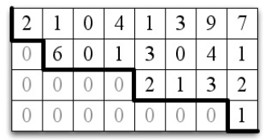

# Chap 08

# 가우스 소거법 - Gaussian Elimination

가우스 소거법(Gaussian Elimination)은 선형방정식의 시스템에 대한 해를 구하는 데에 가장 자주 적용된다. 가우스 소거법은 주로 아래와 같은 곳에 적용된다.

- *주어진 벡터들의 생성에 대한 기저 찾기*
- *행렬의 영공간에 대한 기저 찾기*
- *행렬방정식의 해 구하기*


## 8.1 사다리꼴 - Echelon Form

*사다리꼴(Echelon form)* 행렬은 삼각행렬을 일반화한 것이다. 아래의 행렬은 사다리꼴 행렬의 예시이다.
$$
\begin{bmatrix} 0 & 2 & 3 & 0 & 5 & 6 \\ 0 & 0 & 1 & 0 & 3 & 4 \\ 0 & 0 & 0 & 0 & 1 & 2 \\ 0 & 0 & 0 & 0 & 0 & 9 \end{bmatrix}
$$

- 행 $0$의 첫 번째 영이 아닌 엔트리는 열 $1$에 있다.
- 행 $1$의 첫 번째 영이 아닌 엔트리는 열 $2$에 있다.
- 행 $2$의 첫 번째 영이 아닌 엔트리는 열 $4$에 있다.
- 행 $3$의 첫 번째 영이 아닌 엔트리는 열 $5$에 있다.


***Definition*** : $m \times n$ 행렬 $A$는 다음 조건을 만족하면 *사다리꼴* 이다. 즉, 임의의 행에 대해, 만약 그 행의 첫 번째 영이 아닌 원소가 위치 $k$에 있으면 그 행 이전의 모든 행의 첫 번째 영이 아닌 원소는 $k$보다 작은 어떤 위치에 있다. <br />

즉, 다음과 같은 행렬이 사다리꼴 행렬이라 할 수 있다. ($*$ 은 아무 숫자나 올 수 있다.)
$$
\begin{bmatrix} * & * & * & * \\ 0 & * & * & * \\ 0 & 0 & * & * \end{bmatrix}
$$
위의 Definition에 의하면 $A$의 각 행에 대해 반복할 때마다 각 행의 첫 번째 영이 아닌 엔트리는 반드시 오른쪽으로 이동하여 오른쪽 아래로 내려가는 계단모양을 형성한다.



만약, 아래의 예시와 같이 사다리꼴 행렬에서 어떤 행이 모두 영이면, 그 행 다음에 오는 모든 행 또한 모두 영이어야 한다.
$$
\begin{bmatrix} 0 & 2 & 3 & 0 & 5 & 6 \\ 0 & 0 & 1 & 0 & 3 & 4 \\ 0 & 0 & 0 & 0 & 0 & 0 \\ 0 & 0 & 0 & 0 & 0 & 0 \end{bmatrix}
$$


### 8.1.1 사다리꼴에서 행공간에 대한 기저로

사다리꼴로 된 행렬이 가지는 장점은 무엇일까? <br />

***Lemma*** : 만약 어떤 행렬이 사다리꼴이면, 영이 아닌 행들은 행공간에 대한 기저를 형성한다. 

- 예를 들어, 다음 행렬

$$
\begin{bmatrix} 0 & 2 & 3 & 0 & 5 & 6 \\ 0 & 0 & 1 & 0 & 3 & 4 \\ 0 & 0 & 0 & 0 & 0 & 0 \\ 0 & 0 & 0 & 0 & 0 & 0 \end{bmatrix}
$$

- 의 행공간에 대한 기저는 $\{[0, 2, 3, 0, 5, 6], [0,0,1,0,3,4]\}$ 이다.


*8.1.2 생략*

### 8.1.3 맨 왼쪽의 영이 아닌 위치에 의한 행들의 정렬

모든 행렬이 사다리꼴 형태를 가지는 것은 아니다. 이번 8.1.3에서는 사다리꼴이 아닌 행렬을 사다리꼴 행렬로 변환하는 방법에 대해 알아 보도록 하자. <br />

사다리꼴 행렬은 위의 Definition에서 처럼 맨 왼쪽의 영이 아닌 원소의 위치에 따라 정렬되어야 한다. 아래와 같이 행렬 $A$가  있다고 해보자.
$$
A=\begin{bmatrix} 0 & 2 & 3 & 4 & 5 \\ 0 & 0 & 0 & 3 & 2 \\ 1 & 2 & 3 & 4 & 5 \\ 0 & 0 & 0 & 6 & 7 \\ 0 & 0 & 0 & 9 & 9 \end{bmatrix}
$$
이를 사다리꼴 행렬로 바꾸기 위해서는 행렬 중 행의 성분을 사다리꼴 형태가 되도록 위치를 바꿔주는 피보팅(pivoting)과정이 필요하다. 피보팅 과정을 거치면 아래와 같은 행렬이 된다.
$$
A=\begin{bmatrix} 1 & 2 & 3 & 4 & 5 \\ 0 & 2 & 3 & 4 & 5 \\ 0 & 0 & 0 & 3 & 2 \\ 0 & 0 & 0 & 6 & 7 \\ 0 & 0 & 0 & 9 & 9 \end{bmatrix}
$$
이제 이러한 피보팅 작업을 해주는 과정을 파이썬 코드로 나타내 보자. 아래의 코드는 `pivoting()`메소드를 구현한 코드이다.

```python
def pivoting(mat):
    echelon_mat = []
    col_shape = len(mat[0])
    for idx in range(col_shape):
        for row in mat:
            if row[idx] is not 0:
                echelon_mat.append(row)
                mat.remove(row)
    return echelon_mat
```

```python
A = [[0, 2, 3, 4, 5], 
     [0, 0, 0, 3, 2], 
     [1, 2, 3, 4, 5], 
     [0, 0, 0, 6, 7], 
     [0, 0, 0, 9, 9]]

from pprint import pprint 
pprint(pivoting(A))
'''출력결과
[[1, 2, 3, 4, 5],
 [0, 2, 3, 4, 5],
 [0, 0, 0, 3, 2],
 [0, 0, 0, 9, 9],
 [0, 0, 0, 6, 7]]
'''
```


위의 pivoting 과정을 거쳐 나온 행렬 $A$는 사다리꼴 행렬이라고 할 수 없다. 그 이유는 네 번쨰 행과 다섯 번째 행의 처음으로 영이 아닌 원소는 네 번째 열에 위치하기 때문이다. 

### 8.1.4 기본행덧셈 연산 (Elementary row-addition operation)

이러한 문제를 해결하는 방법으로는 *elementary row-addtion operation* 이 있다. 영어로 써놔서 엄청 어려운 과정처럼 보이지만, 위의 행렬 $A$ 에서 사다리꼴 행렬이 되지 않는 원인인 네 번째와, 다섯 번째의 행을 세 번째의 행으로 *곱셈과 뺼셈* 을 이용해 해당 원소를 $0$으로 만들어 주면 된다. <br />

네 번째 행 $\begin{bmatrix} 0 & 0 & 0 & 6 & 7 \end{bmatrix}$ 은 아래와 같이 세 번째 행 $\begin{bmatrix} 0 & 0 & 0 & 3 & 2 \end{bmatrix}$를 이용해 네 번째 열의 원소를 $0$으로 만들어 줄 수 있다.
$$
\begin{bmatrix} 0 & 0 & 0 & 6 & 7 \end{bmatrix}-2\begin{bmatrix} 0 & 0 & 0 & 3 & 2 \end{bmatrix}=\begin{bmatrix} 0 & 0 & 0 & 0 & 3 \end{bmatrix}
$$
다섯 번째 행 $\begin{bmatrix} 0 & 0 & 0 & 9 & 9 \end{bmatrix}$는,
$$
\begin{bmatrix} 0 & 0 & 0 & 9 & 9 \end{bmatrix}-3\begin{bmatrix} 0 & 0 & 0 & 3 & 2 \end{bmatrix}=\begin{bmatrix} 0 & 0 & 0 & 0 & 3 \end{bmatrix}
$$
이된다. 따라서, 아래와 같은 행렬이 얻어진다.
$$
A^{'} = \begin{bmatrix} 1 & 2 & 3 & 4 & 5 \\ 0 & 2 & 3 & 4 & 5 \\ 0 & 0 & 0 & 3 & 2 \\ 0 & 0 & 0 & 0 & 3 \\ 0 & 0 & 0 & 0 & 3 \end{bmatrix}
$$
$A^{'}$ 행렬에서 네 번째행을 이용하여,
$$
\begin{bmatrix} 0 & 0 & 0 & 0 &3 \end{bmatrix}-1\begin{bmatrix} 0 & 0 & 0 & 0 & 3 \end{bmatrix}=\begin{bmatrix} 0 & 0 & 0 & 0 & 0 \end{bmatrix}
$$
다섯 번째행을 $\begin{bmatrix} 0 & 0 & 0 & 0 & 0 \end{bmatrix}$ 으로 만들어 주게 되어, 최종적으로 아래와 같은 행렬이 만들어 진다.
$$
A^{''} = \begin{bmatrix} 1 & 2 & 3 & 4 & 5 \\ 0 & 2 & 3 & 4 & 5 \\ 0 & 0 & 0 & 3 & 2 \\ 0 & 0 & 0 & 0 & 3 \\ 0 & 0 & 0 & 0 & 0 \end{bmatrix}
$$

