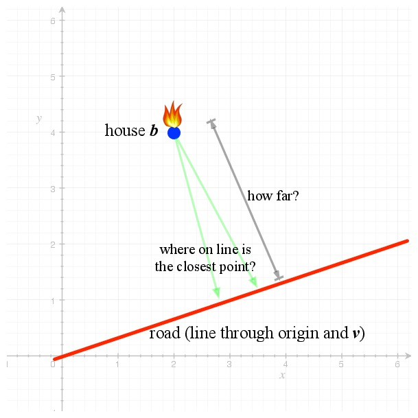

# Chap 09

# 내적 - Inner Product

이번 9장에서는 *길이* (length)와 *직교* (perpendicular)의 개념이 수학적 용어로 어떻게 해석되는지 알아본다. 어떤 점에 가장 가까운 주어진 직선상의 점을 찾는 문제에 대해 살펴본다. 

## 9.1 *소방차* 문제

아래의 그림에서 좌표 $[2,4]$ 에 위치한 집 $b$에 화재가 났다고 하자. 집 주변을 지나가는 도로는 원점과 점 $[6,2]$ 을 지나는 직선이면, 집 $b$와 가장 가까운 직선상의 어떤 지점으로 소방차를 위치 시킬 수 있으면 화재를 진압 시킬 수 있다고 하면, 두 가지를 생각할 수 있다.

- *직선상의 어느 점이 집 $b$와 가까운가?*
- *그렇다면, 가장 가까운 거리는 얼마나 되는가?*

이것을 계산문제로 재구성 해보자. 앞의 [3.5.3](https://render.githubusercontent.com/view/ipynb?commit=a1af54cf049c9501c8ae5d311e82ae796536b138&enc_url=68747470733a2f2f7261772e67697468756275736572636f6e74656e742e636f6d2f457863656c73696f72434a482f53747564792f613161663534636630343963393530316338616535643331316538326165373936353336623133382f4c696e656172416c67656272612f436f64696e675468654d61747269782f4368617030332532302d253230546865253230566563746f722f4368617030332d5468655f566563746f722e6970796e62&nwo=ExcelsiorCJH%2FStudy&path=LinearAlgebra%2FCodingTheMatrix%2FChap03+-+The+Vector%2FChap03-The_Vector.ipynb&repository_id=116745719&repository_type=Repository#3.5.3-%EC%9B%90%EC%A0%90%EC%9D%84-%EC%A7%80%EB%82%98%EB%8A%94-%EC%84%A0%EB%B6%84) 에서 처럼 원점을 지나는 직선은 벡터의 스칼라배들의 집합으로서 표현할 수 있다. 위의 그림에서 도로는 직선 $\{\alpha [3,1] : \alpha \in \mathbb{R} \}$ 로 나타낼 수 있다. 따라서, 위의 *소방차* 문제는 아래와 같이 구성할 수 있다.

***Computational Problem*** : 하나의 주어진 벡터에 가장 가까운 다른 하나의 주어진 벡터의 생성(Span) 내에 있는 벡터

- *input* : 벡터 $v$ 및 $b$
- *output* : $b$에 가장 가까운 직선 $\{ \alpha v : \alpha \in \mathbb{R} \}$ 상의 점

### 9.1.1 거리, 길이, norm, 내적

두 벡터 $p$ 와 $b$ 사이의 거리는 차분(difference) $p-b$ 로 정의한다. 이것은 벡터의 길이를 정의해야 한다는 것을 의미한다.(?) 벡터에 대해 "*길이* "라는 용어를 사용하는 대신에 보통 $norm$ 을 사용한다. 

벡터 $v$ 의 $norm$은 $||v||$ 로 표현한다. $norm$ 은 길이 역할을 하므로, 다음의 $norm$ 성질을 만족해야 한다.

- Property N1 : 임의의 벡터 $v$ 에 대해, $||v||$ 은 영($0$)이 아닌 실수이다.
- Property N2 : 임의의 벡터 $v$ 에 대해, $||v||$ 이 영($0$)이 될 필요충분조건은 $v$ 가 영벡터인 것이다.
- Property N3 : 임의의 벡터 $v$ 와 임의의 스칼라 $\alpha$ 에 대해, $||\alpha v|| = |\alpha| \cdot  ||v||$ 이다.
- Property N4 : 임의의 벡터 $u$ 와 $v$ 에 대해, $||u + v|| \le ||u|| + ||v||$  이다. 