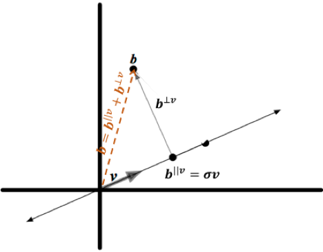
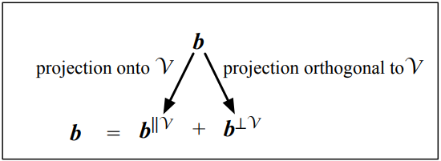
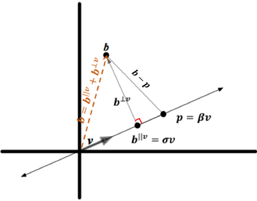
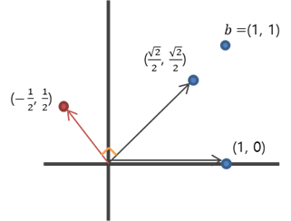

# Chap 10

# 직교화(Orthogonalization)

이번 장의 첫 번째 목적은 다음 문제에 대한 알고리즘을 제시하는 것이다.

> **Computational Problem** : *(여러 벡터들의 Span 내에 있는 가장 가까운점 )*  주어진 벡터 $b$ 와 실수 벡터들 $v_1, ..., v_n$ 에 대해, Span $\{v_1, ..., v_n\}$ 내에 있으며 $b$ 에서 가장 가까운 벡터를 찾아보자.


$A=\begin{bmatrix}  &  &  \\ v_{ 1 } & \cdots  & v_{ m } \\  &  &  \end{bmatrix}$ 라 하고, 행렬-벡터 곱셈의 선형결합 정의에 의하면, Span $\{v_1, ..., v_m \}$ 내 벡터들의 집합은 $Ax$ 로 표현할 수 있는 벡터들의 집합이다. 따라서, 결국 계수(좌표)들을 찾는 것은 $\left\| b-Ax \right\| $ 을 최소화 하는 벡터 $x$ 를 찾는 것과 같다. 이것을 *최소제곱* (least-squares) 문제라고 한다.


## 10.1 복수의 벡터들에 직교하는 투영

9장에서 살펴보았던 [*소방차 문제*](https://render.githubusercontent.com/view/ipynb?commit=dfd2db6c10417913bcf457a4a3c3c64378d8a767&enc_url=68747470733a2f2f7261772e67697468756275736572636f6e74656e742e636f6d2f457863656c73696f72434a482f53747564792f646664326462366331303431373931336263663435376134613363336336343337386438613736372f4c696e656172416c67656272612f436f64696e675468654d61747269782f4368617030392532302d253230546865253230496e6e657225323050726f647563742f4368617030392d5468655f496e6e65725f50726f647563742e6970796e62&nwo=ExcelsiorCJH%2FStudy&path=LinearAlgebra%2FCodingTheMatrix%2FChap09+-+The+Inner+Product%2FChap09-The_Inner_Product.ipynb&repository_id=116745719&repository_type=Repository#9.1-%EC%86%8C%EB%B0%A9%EC%B0%A8-%EB%AC%B8%EC%A0%9C) 와 같이 직교성과 투영(projection)을 사용하여 풀 수 있다.


### 10.1.1 벡터들의 집합에 대한 직교

9장에서는 한 벡터가 다른 벡터에 직교한다는 것이 무엇을 의미하는지 살펴 보았다면, 이번 장에서는 한 벡터가 벡터들의 집합에 직교하는 것이 무엇을 의미하는지를 살펴본다.

***Definition*** : 벡터 $v$ 는 만약 $\mathcal{S}$ 내의 모든 벡터에 직교하면 벡터들의 집합 $\mathcal{S}$ 에 직교한다.

***Example 10.1.2*** : 벡터 $[2,0,-1]$ 은 $[0,1,0]$과 $[1, 0, 2]$에 직교하므로 집합 $\{[0,1,0], [1, 0, 2]\}$에 직교한다. 또한, $[2, 0, -1]$ 벡터는 무한 집합 $\mathcal{V} = $ Span $\{[0, 1, 0], [1, 0, 2]\}$ 에 직교한다. 그 이유는 $\mathcal{V}$ 내의 모든 벡터는 $\alpha [0, 1, 0] + \beta [1, 0, 2]$ 이고 다음이 성립하기 때문이다.
$$
\begin{eqnarray} \left< [2,0,-1],\alpha [0,1,0]+\beta [1,0,2] \right>  & = & \alpha \left< [2,0,-1],[0,1,0] \right> +\beta \left< [2,0,-1],[1,0,2] \right>  \\  & = & \alpha 0 + \beta 0 \end{eqnarray}
$$


***Lemma*** :  벡터 $v$ 가 벡터들 $a_1, ..., a_n$ 각각에 직교할 필요충분조건은 $v$ 가 Span $\{a_1, ..., a_n\}$ 내의 모든 벡터에 직교하는 것이다.

- **Proof** : $v$ 는 $a_1, ..., a_n$ 에 직교한다고 하고, $w$ 는 Span $\{a_1, ..., a_n\}$ 내의 임의의 벡터라고 하자. $v$ 는 $w$ 에 직교한다는 것을 보이면 된다. Span의 정의에 의하면 다음을 만족하는 계수 $\alpha_1, ..., \alpha_n $ 이 있다.

$$
w = \alpha_1 a_1 + \cdots + \alpha_n a_n
$$

- 그러므로, 직교의 성질을 사용하면 다음이 성립한다.

$$
\begin{eqnarray} \left< v,w \right>  & = & \left< v,\alpha _{ 1 }a_{ 1 }+\cdots +\alpha _{ n }a_{ n } \right>  \\  & = & \alpha \left< v,a_{ 1 } \right>  \\  & = & \alpha _{ 1 }0+\cdots +\alpha _{ n }0 \\  & = & 0 \end{eqnarray}
$$

- 따라서, $v$ 는 $w$ 에 직교한다. 이제, $v$ 는 Span $\{a_1, ..., a_n\} $ 의 모든 벡터에 직교한다고 해보자. Span $\{a_1, ..., a_n\} $ 은 $a_1,..., a_n$ 을 포함하므로 $v$ 는 $a_1, ..., a_n$ 에 직교한다.


###  10.1.2 벡터공간상으로의 투영 및 벡터공간에 직교하는 투영

***Definition*** : 벡터 $b$ 와 벡터공간 $\mathcal{V}$ 에 대해, $b$ 의 $\mathcal{V}$ 상으로의 투영 ($b^{||\mathcal{V}}$) 과 $b$ 의 $\mathcal{V}$ 에 직교하는 투영 ($b^{\bot \mathcal{V}}$) 을 정의해 보자. 그러면, 다음과 같이 쓸 수 있다.
$$
b = b^{|| \mathcal{V}} + b^{\bot \mathcal{V}}
$$


그리고, $b^{|| \mathcal{V}}$ 는 $\mathcal{V}$ 에 속하고, $b^{\bot \mathcal{V}}$ 는 $\mathcal{V}$ 에 속하는 모든 벡터에 직교한다.




***Lemma*** : $\mathcal{V}$ 는 벡터공간이라 하고, $b$ 는 벡터라고 하자. $\mathcal{V}$ 에 속하며 $b$ 에 가장 가까운 점은 $b^{|| \mathcal{V}}$ 이고, 그 거리는 $\left\| b^{\bot \mathcal{V}} \right\| $ 이다.



- **Proof** :  $b$ 와 $b^{|| \mathcal{V}}$ 사이의 거리는 $\left\| b- b^{|| \mathcal{V}} \right\|$ 이다. $p$ 는 $\mathcal{V}$ 의 임의의 점이라고 하면, $p$ 는 $b^{|| \mathcal{V}}$ 보다 $b$ 에 가깝지 않다는 것을 보여 보자. 

$$
b-p = \left( b-b^{|| \mathcal{V}} \right) + \left( b^{|| \mathcal{V}} - p \right)
$$

- 우변에서 $b - b^{|| \mathcal{V}} = b^{\bot \mathcal{V}}$ 이고, $ b^{|| \mathcal{V}} - p$ 는 $\mathcal{V}$ 에 속하는 두 벡터의 차이이므로 $\mathcal{V}$ 내에 있다. $b^{\bot \mathcal{V}}$ 는 $\mathcal{V}$ 에 직교하므로, 피타고라스 정리에 의하면 다음이 성립한다.

$$
\left\| b-p \right\| ^{2} = \left\| b-b^{|| \mathcal{V}} \right\|^{2} + \left\| b^{|| \mathcal{V}} - p \right\|^{2}
$$

- 따라서, $p \neq b^{|| \mathcal{V}}$ 이면 $\left\| b-p \right\| > \left\| b- b^{|| \mathcal{V}} \right\|$ 이 성립한다.


### 10.1.3 벡터들의 리스트에 직교하는 투영 - 첫 번째 시도

파이썬을 이용해서 다음을 만족하는 `project_orthogonal()` 함수를 작성해보자.

- *input* : 벡터 $b$, 벡터들의 리스트 $vlist$
- *output* : Span $vlist$ 에 직교하는 $b$ 의 투영 (즉, $b^{\bot \mathcal{V}}$)


아래의 코드는 [9.3.4](http://nbviewer.jupyter.org/github/ExcelsiorCJH/Study/blob/master/LinearAlgebra/CodingTheMatrix/Chap09%20-%20The%20Inner%20Product/Chap09-The_Inner_Product.ipynb#9.3.4-투영-및-가장-가까운-점-찾기) 에서 작성한 `project_along()` 함수를 이용하여 `project_orthogonal()` 함수를 구현한 코드이다.

```python
def project_along(b, v):
    bv = 0
    vv = 0
    for u, w in zip(b, v):
        bv += u*w
    for u,w in zip(v, v):
        vv += u*w
    
    sigma = (bv / vv) if vv > 1e-20 else 0
    return [sigma*e for e in v]


def project_orthogonal(b, vlist):
    for v in vlist:
        b = [e1 - e2 for e1, e2 in zip(b, project_along(b, v))]
    return b
```

```python
>>> vlist = [[1, 0], [2**(1/2)/2, 2**(1/2)/2]]
>>> b = [1,1]

>>> project_orthogonal(b, vlist)
[-0.5, 0.5]
```

위의 `project_orthogonal()` 함수는 문제가 있다. 예를 들어 $b= [1,1]$, $vlist = [[1,0], [\frac{\sqrt{2}}{2}, \frac{\sqrt{2}}{2}]]$ 라고 할 경우 `project_orthogonal()` 의 출력값은 `[-0.5, 0.5]` 이다.  이 벡터는 아래의 그림과 같이 $vlist$ 의 $[1, 0]$ 과 직교하지 않는다.




## 10.2 *서로 직교* 하는 벡터들의 리스트에 직교하는 $b$ 의 투영

그렇다면, 위의 `project_orthogonal()` 함수가 동작하도록 하는 $vlist$ 들을 만들어 보자. 예를 들어,  $vlist$ 에 $v_1 = [1, 2, 1]$, $v_2,=[-1, 0, 1]$ 과 $b=[1, 1, 2]$ 라고 하면 다음과 같은 결과가 나온다.

```python
>>> vlist = [[1, 2, 1], [-1, 0, 1]]
>>> b = [1, 1, 2]

>>> b_orthogonal = project_orthogonal(b, vlist)
>>> b_orthogonal = [round(e, 2) for e in b_orthogonal]  # 소수점 둘째자리까지 출력
>>> print(b_orthogonal)
[0.67, -0.67, 0.67]
```


이 결과값은 $vlist$ 의 $v_1$ 과 $v_2$ 두 벡터에 각각 직교한다. 또한 $v_1$ 과 $v_2$ 는 서로 직교한다. 이것을  [9.3.4](http://nbviewer.jupyter.org/github/ExcelsiorCJH/Study/blob/master/LinearAlgebra/CodingTheMatrix/Chap09%20-%20The%20Inner%20Product/Chap09-The_Inner_Product.ipynb#9.3.4-투영-및-가장-가까운-점-찾기) 에서 배웠던 공식을 이용하면 다음과 같다.

$\left< v_1, b \right>=0$ 이고, $\left< v_1, v_2 \right> = 0$ 이므로, 
$$
\begin{eqnarray} \left< v_{ 1 },b-\sigma v_{ 2 } \right>  & = & \left< v_{ 1 },b \right> -\left< v_{ 1 },\sigma v_{ 2 } \right>  \\  & = & \left< v_{ 1 },b \right> -\sigma \left< v_1, v_2 \right>  \\  & = & 0+0 \end{eqnarray}
$$
즉,  10.1.3과 달리 input 값을 아래와 같이 설정해주면 `project_orthogonal()`은 제대로 동작한다.

- *input* : 벡터 $b$, *서로 직교* 하는 벡터들의 리스트 $vlist$
- output : $vlist$ 에 속하는 벡터들에 직교하는 $b$ 의 투영 $b^{\bot}$


### 10.2.1 프로시저 `project_orthogonal()`이 맞게 동작하는지 증명하기

***Theorem*** *(`project_orthogonal()`의 정확성)* : 벡터 $b$ 와 서로 직교하는 벡터들의 리스트 `vlist` 에 대해, 함수 `project_orthogonal(b, vlist)` 는 $b^{\bot}$ 을 반환한다. 이때, $b^{\bot}$ 은 `vlist` 에 속하는 벡터들에 직교하며 $b - b^{\bot}$ 은 `vlist` 에 속하는 벡터들의 Span에 속한다.

함수 `project_orthogonal()`이 맞다는 것을 증명하기 위해, $i$ 이터레이션 후 $i$ 를 포함하는 `vlist`가 $i = 0, 1, 2, ... $ 에 대해 참이라는 것을 보여 준다. 이러한 방법을 *루프불변 (loop invariant)*  

***Lemma*** *(`project_orthogonal`에 대한 루프불변)* : $k=$ `len(vlist)` 라고 하면, $i = 0, ..., k$ 에 대해, $b_i$는 $i$ 이터레이션 후 변수 `b`(`project_orthogonal`의 결과값, 즉 $b^{\bot}$) 의 값이라고 하자.

-  $b_i$ 는 `vlist`에 속하는 첫 $i$ 개 벡터들에 직교한다.
- $b-b_i(=b-b_{i}^{\bot})$ 은 `vlist`에 속하는 첫 $i$ 개 벡터들의 Span에 속한다.


`project_orthogonal`함수에 의해 반환되는 벡터 $b^{\bot}$ 은 모든 $k$ 이터레이션 후 $b$의 값이며 $b_k$ 로 나타낸다. 루프불변의 $k$ 에 $i$ 를 대입하면 다음을 얻는다.

- $b_{k}^{\bot}$ 은 `vlist`의 첫 $k$ 개 벡터에 직교하고 $b-b_{k}^{\bot}$ 는 Span {`vlist`}에 속한다.

  - **Proof** :  증명은 $i$ 에 대해 귀납법을 사용한다. $i=0$ 인 경우, 루프불변은 참이다: $b_0$ 는 첫 0개 벡터들의 각각에 직교하고, $b-b_0$ 은 첫 0개 벡터들의 Span에 속한다(왜냐하면, 영벡터이기 때문에!). $i-1$ 이터레이션에 대해 루프불변이 성립한다고 가정하자. 그런 다음  $i$-이터레이션에 대해 루프불변이 성립함을 증명하면 된다. `vlist`를 $[v_1,...,v_k]$ 로 나타내자.
  - $i$ 번째 이터레이션에서 함수는 다음을 계산한다.

  $$
  \begin{eqnarray} b_{ i }^{ \bot  } & = & b_{ i-1 }^{\bot}-project_{ a }long(b_{ i-1 },v_{ i }) \\  & = & b_{ i-1 }^{\bot} - \sigma _{ i }v_{ i } \end{eqnarray}
  $$

  - 여기서 $\sigma_i = \frac{\left< b_{i-1}, v_i \right>}{\left< v_i, v_i \right>}$ 이다.  귀납 가설은  $b_{i-1}$ 이 첫 $i-1$ 개 벡터들에 직교하는 $b_0$ 의 투영이라는 것이다.
  - $b_{i}^{\bot}$ 가 $\{v_1,...,v_{i-1},v_i\}$ 에 속하는 각 벡터에 직교한다는 것을 증명해야 한다. $i > j$ 라고 하면

  $$
  \begin{eqnarray} \left< b_{ i }^{\bot},v_{ j } \right>  & = & \left< b_{ i-1 }^{\bot} - \sigma _{ i }v_{ i },v_{ j } \right>  \\  & = & \left< b_{ i-1 }^{\bot},v_{ j } \right> -\sigma _{ i }\left< v_{ i },v_{ j } \right>  \\  & = & 0-\sigma _{ i }\left< v_{ i },v_{ j } \right>  \\  & = & 0-\sigma _{ i }0 \end{eqnarray}
  $$

  - 또한, $b_0 - b_{i}^{\bot}$ 는 `vlist`의 첫 $i$ 개의 벡터들의 Span에 속한다는 것을 증명해야 한다. 귀납가설에 의하면, $b_0 - b_{i-1}^{\bot}$ 은 $i-1$ 개 벡터들의 Span에 속한다. 

  $$
  \begin{eqnarray}b_0 - b_{i}^{\bot}  & = & b_0 - ( b_{i-1}^{\bot} - \sigma_i v_i)  \\  & = & (b_0 -  b_{i-1}^{\bot}) + \sigma_1 v_i \\  & = & (첫 i-1개 벡터들의 Span에 속하는 벡터) + \sigma_i v_i  \\  & = & 첫 i 개 벡터들의 Span에 속하는 벡터 \end{eqnarray}
  $$


### 10.2.2 `project_orthogonal()` 보완하기

$b-b^{\bot}$ 이 벡터들 $v_0,...,v_{k-1}$ 의 생성에 속한다는 것을 다음과 같이 표현할 수 있다. 
$$
\begin{eqnarray} b-b^{ \bot  } & = & \sigma _{ 0 }v_{ 0 }+\cdots + \sigma _{ k-1 }v_{ k-1 } \\ b  & = & \sigma _{ 0 }v_{ 0 }+\cdots + \sigma _{ k-1 }v_{ k-1 }+1b^{ \bot  } \end{eqnarray}
$$

$$
\begin{bmatrix}  \\  \\ b \\  \\  \end{bmatrix}=\begin{bmatrix}  &  &  &  \\  &  &  &  \\ v_{ 0 } & \cdots  & v_{ k-1 } & b^{ \bot  } \\  &  &  &  \\  &  &  &  \end{bmatrix}\begin{bmatrix} \sigma _{ 0 } \\ \sigma _{ 1 } \\ \vdots  \\ \sigma _{ k-1 } \\ 1 \end{bmatrix}
$$

위의 식을 반영하여, `project_orthogonal(b, vlist)` 를 보완한 `aug_project_orthogonal(b, vlist)` 함수를 구현해보자.

- input : 벡터 b, 서로 직교하는 실수 벡터들의 리스트 [$v_0, ..., v_{k-1}]$
- output: 튜플 ($b^{\bot}, sigmadict$) 이 튜플은 다음을 만족한다.
  - 튜플의 첫 번째 원소는 $b$ 의 투영 $b^{\bot}$ 이며 이것은 Span $\{v_0, ..., v_{k-1}\}$ 에 직교한다.
  - 튜플의 두 번째 원소는 딕셔너리 $sigmadict = \{0: \sigma_0, 1: \sigma_1,...,(k-1) : \sigma_{k-1}, k:1\}$ 이며 다음을 만족한다.

$$
b  =  \sigma _{ 0 }v_{ 0 }+\cdots + \sigma _{ k-1 }v_{ k-1 }+1b^{ \bot  }
$$

```python
def aug_project_orthogonal(b, vlist):
    sigmadict = {len(vlist): 1}
    for i, v in enumerate(vlist):
        bv = 0
        vv = 0
        for u, w in zip(b, v):
            bv += u*w
        for u,w in zip(v, v):
            vv += u*w
        sigma = bv/vv if vv > 1e-20 else 0
        sigmadict[i] = round(sigma, 2)
        b = [round(e1 - sigma*e2, 2) for e1, e2 in zip(b, v)]
    return b, sigmadict
```

```python
>>> b = [1, 1, 2]
>>> vlist = [[1, 2, 1], [-1, 0, 1]]

>>> aug_project_orthogonal(b, vlist)
([0.67, -0.67, 0.67], {0: 0.83, 1: 0.5, 2: 1})
```


## 10.3 생성자들의 직교집합 만들기

이번 장의 목표는 맨처음에서도 살펴 보았듯이 임의의 벡터들 $v_1,...,v_n$ 으로 구성된 집합의 생성에 직교하게 $b$ 를 투영하는 것이다. 10.1 ~ 10.2 까지 구현했던 함수들은 서로 직교하는 벡터들로 구성된  $vlist$ 에 직교하는 $b$ 를 투영하는 것에서는 제대로 동작하였다. 

이제는 서로 직교하지 않을 수도 있는 벡터들 $v_1, ..., v_n$ 의 생성에 직교하게 $b$를 투영해보자. 이를 위해서는  Span $\{v_1, ..., v_n\}$ 에 대한 *서로 직교하는 생성자(generator)* 를 먼저 찾아야 한다.

따라서, 새로운 함수인 *직교화(orthogonalization)* 가 필요하다.

- *input* : 실수 벡터들의 리스트 $[v_1,...,v_n]$
- *output* : 다음을 만족하는 서로 직교하는 벡터들 $v_{1}^{*},...,v_{n}^{*}$ 의 리스트

$$
Span \{v_{1}^{*},...,v_{n}^{*}\} = Span \{v_1, ..., v_n\}
$$


### 10.3.1 `orthogonalize()` 프로시저

`orthogonalize()` 함수를 구현하기 위해 위에서 작성한 `project_orthogonal()` 함수를 반복하여 서로 직교하는 벡터들의 리스트를 만들어 준다. 

먼저, $v_1$ 벡터를 고려해 보자. 집합 $\{v_{1}^{*}\}$ 은 서로 직교하는 벡터들의 집합이므로 $v_{1}^{*} := v_1$ 이라고 정의하자. 다음으로,  $v_{2}^{*}$ 는 $v_{1}^{*}$ 에 직교하는 $v_2$ 의 투영이라고 정의하자. 그렇게 되면, $\{v_{1}^{*}, v_{2}^{*}\}$ 은 서로 직교하는 벡터들의 집합이다. 그 다음으로 $v_{3}^{*}$ 는 $v_3$ 의 투영이고 $v_{1}^{*}$ 과 $v_{2}^{*}$ 직교하는 벡터라고 하자. 이런 식으로 $v_{n}^{*}$ 까지 진행하여 직교하는 벡터들을 찾는다.  따라서, $i$ 번째에서는 $v_i$ 를 $v_{1}^{*},...,v_{i-1}^{*}$ 에 직교하게 투영하는 $v_{i}^{*}$ 를 찾는다.

위의 방법을 코드로 나타내면 다음과 같다. 

```python
def orthogonalize(vlist):
    vstarlist = []
    for v in vlist:
        vstarlist.append(project_orthogonal(v, vstarlist))
    return vstarlist
```

```python
>>> vlist = [[2, 0, 0], [1, 2, 2], [1, 0, 2]]

>>> orthogonalize(vlist)
[[2, 0, 0], [0.0, 2.0, 2.0], [0.0, -1.0, 1.0]]
```


***Example 10.3.2*** : 위의 출력 결과에서 알 수 있듯이, 아래의 `vlist` 에 대해 `orthogonalize()` 호출하면,  다음과 같은 $v^{*}list$ 가 반환된다.
$$
v_1 = [2, 0, 0], v_2 = [1, 2, 2], v_3 = [1, 0, 2]
$$

$$
v_{1}^{*}=[2,0,0], v_{2}^{*} = [0, 2, 2], v_{3}^{*}=[0, -1, 1]
$$

- 첫 번째 이터레이션에서, `v`는 $v_1$ 이고 `vstarlist` 가 빈 리스트이므로 `vstarlist`에 추가되는 첫 번째 벡터 $v_{1}^{*}$ 은 $v_1$ 이다. 
- 두 번째 이터레이션에서, `v` 는 $v_2$ 이고 `vstarlist`는 $v_{1}^{*}$ 만으로 구성되어 있어 $v_2$ 의 $v_{1}^{*}$에 직교하는 투영은 다음과 같다.

$$
\begin{eqnarray} v_{ 2 }-\frac { \left< v_{ 2 },v_{ 1 }^{ * } \right>  }{ \left< v_{ 1 }^{ * },v_{ 1 }^{ * } \right>  } v_{1}^{*}  & = & [1,2,2]-\frac { 2 }{ 4 } [2,0,0] \\  & = & [0,2,2] \end{eqnarray}
$$

- 세 번째 이터레이션에서, `v` 는 $v_3$ 이고 `vstarlist`는 $v_{1}^{*}$ 와 $v_{2}^{*}$ 로 구성되어 있어 $v_3$ 의 $v_{1}^{*}$ 에 직교하는 투영은 $[0, 0, 2]$ 이고, $[0, 0, 2]$의 $v_{2}^{*}$ 에 직교하는 투영은 다음과 같다.

$$
[0, 0, 2] - \frac{1}{2} [0, 2, 2] = [0, -1, 1]
$$


### 10.3.2 `orthogonalize()` 가 맞게 동작하는지 증명하기

`orthogonalize()` 가 제대로 동작하는지 보여주기 위해, 리턴되는 벡터들로 구성된 리스트(`vstarlist`)의 Span이 입력으로 제공된 벡터들로 구성된 리스트(`vlist`)의 Span과 동일함을 보여야 한다.

***Lemma*** : `orthogonalize`를 $n$-원소 리스트 $[v_1,...,v_n]$ 에 적용하면, $i$ 번째 이터레이션 후 Span {`vstarlist`} = Span $\{v_1, ..., v_i\}$ 이다.

- **Proof** : 

$$
Span \{v_{1}^{*}, ..., v_{i-1}^{*}\} = Span \{v_1,...,v_{i-1}\}
$$

- 벡터 $v_i$ 를 양변의 집합에 더하면 다음과 같다.

$$
Span \{v_{1}^{*}, ..., v_{i-1}^{*},  v_i\} = Span \{v_1,...,v_{i-1}, v_i\}
$$

- 따라서, $Span \{v_{1}^{*}, ..., v_{i-1}^{*},  v_{i}^{*}\} = Span \{v_1,...,v_{i-1}, v_i\}$ 임을 보여주면 된다.
- $i$ 번째 이터레이션에서 `project_orthogonal`($v_i, [v_{1}^{*}, ..., v_{i-1}^{*}]$) 을 사용하여 $v_{i}^{*}$ 을 계산한다.

$$
v_i = \sigma_{1,i} v_{1}^{*} + \cdots + \sigma_{i-1,i} v_{i-1}^{*} + v_{i}^{*}
$$

- 위의 식은 $v_{1}^{*}, ..., v_{i-1}^{*},  v_i$ 벡터들의 임의의 선형결합은 $v_{1}^{*}, ..., v_{i-1}^{*},  v_{i}^{*}$ 벡터들의 선형결합으로 변환할 수 있고, 그 역도 성립한다.


이러한 직교화(orthogonalization)은 수학자 그램(Gram)과 슈미트(Schmidt)의 이름을 따 *[Gram-Schmidt 직교화](http://darkpgmr.tistory.com/165)* 라고 한다.

위의 식 $v_i = \sigma_{1,i} v_{1}^{*} + \cdots + \sigma_{i-1,i} v_{i-1}^{*} + v_{i}^{*}$ 을 행렬형태로 나타내면 다음과 같다.
$$
\begin{bmatrix}  &  &  &  &  \\  &  &  &  &  \\ v_{ 1 } & v_{ 2 } & v_{ 3 } & \cdots  & v_{ n } \\  &  &  &  &  \\  &  &  &  &  \end{bmatrix}=\begin{bmatrix}  &  &  &  &  \\  &  &  &  &  \\ v_{ 1 }^{ * } & v_{ 2 }^{ * } & v_{ 3 }^{ * } & \cdots  & v_{ n }^{ * } \\  &  &  &  &  \\  &  &  &  &  \end{bmatrix}\begin{bmatrix} 1 & \sigma_{12} & \sigma_{13} & \cdots & \sigma_{1n} \\  & 1 & \sigma_{23} & \cdots & \sigma_{2n} \\  &  & 1 & \cdots & \sigma_{3n} \\  &  &  & \ddots  & \sigma_{n-1,n} \\  &  &  &  & 1 \end{bmatrix}
$$
우변의 두 행렬은 특수한 형태를 띤다. 첫 번째 행렬은 서로 직교하는 열벡터들을 가진다. 두 번째 행렬은 정방행렬이며 $ij$ 원소는 $i>j$ 이면 영(0)인 상삼각(Upper-Triangular) 행렬이다. 


#### Gram-Schmidt Orthogonalization

*Gram-Shcmidt Orthogonalization* 은 주어진 벡터들 $v_1, ..., v_n$을 생성할 수 있는 *직교기저(orthogonal basis)* 를 구하는 과정이다.

주어진 벡터들 $v_1, ..., v_n$에 대하여, 이 벡터들을 생성할 수 있는 직교 벡터 $v_{1}^{*}, ..., v_{n}^{*}$ 들은 다음과 같이 구해진다.
$$
\begin{eqnarray} v_{ 1 }^{ * } & = & v_{ 1 } \\ v_{ 2 }^{ * } & = & v_{ 2 }-proj_{ v_{ 1 }^{ * } }(v_{ 2 })=v_{ 2 }-\sigma _{ 12 }v_{ 1 }^{ * } \\  & = & v_{ 2 }-\frac { \left< v_{ 2 },v_{ 1 }^{ * } \right>  }{ \left< v_{ 1 }^{ * },v_{ 1 }^{ * } \right>  } v_{ 1 }^{ * } \\ v_{ 3 }^{ * } & = & v_{ 3 }-proj_{ v_{ 1 }^{ * } }(v_{ 3 })-proj_{ v_{ 2 }^{ * } }(v_{ 3 })=v_{ 3 }-\sigma _{ 13 }v_{ 1 }^{ * }-\sigma _{ 23 }v_{ 2 }^{ * } \\  & = & v_{ 3 }-\frac { \left< v_{ 3 },v_{ 1 }^{ * } \right>  }{ \left< v_{ 1 }^{ * },v_{ 1 }^{ * } \right>  } v_{ 1 }^{ * }-\frac { \left< v_{ 3 },v_{ 2 }^{ * } \right>  }{ \left< v_{ 2 }^{ * },v_{ 2 }^{ * } \right>  } v_{ 2 }^{ * } \\ \vdots  &  &  \\ v_{ n }^{ * } & = & v_{ n }-\sum _{ i=1 }^{ n-1 }{ proj_{ v_{ i }^{ * } }(v_{ n }) }  \\  & = & v_n - \sigma_{1n} v_{1}^{*} - \cdots - \sigma_{n-1, n} v_{n-1}^{*} \end{eqnarray}
$$
위의 계산을 통해 얻어진 $v_{1}^{*},...,v_{n}^{*}$ 은 서로 직교(orthogonal)하며, 벡터공간 Span $\{v_1, v_2, ..., v_n\}$ 에 대한 직교기저가 된다. 

아래의 예제 이미지*(출처: [Wikipedia](https://en.wikipedia.org/wiki/Gram%E2%80%93Schmidt_process))* 는 $R^3$에 대한 직교화 과정을 통해 *Gram-Schmidt orthogonormalization* 을 구하는 과정이다.  이미지의 $u_i$ 의 값은 위의 식에서 $v_{i}^{*}$ 이다.


## 10.4 벡터들의 생성에 속하는 점에 *가장 가까운* 계산문제 풀기

이제 Span $\{v_1, ..., v_n\}​$ 에 속하며 $b​$ 에 가장 가까운 벡터를 찾는 문제를 해결할 수 있다.  [9.3.3 의 Lemma](https://render.githubusercontent.com/view/ipynb?commit=d3eb8ec00c75d8d148325cbb257d9b743feb7fb2&enc_url=68747470733a2f2f7261772e67697468756275736572636f6e74656e742e636f6d2f457863656c73696f72434a482f53747564792f643365623865633030633735643864313438333235636262323537643962373433666562376662322f4c696e656172416c67656272612f436f64696e675468654d61747269782f4368617030392532302d253230546865253230496e6e657225323050726f647563742f4368617030392d5468655f496e6e65725f50726f647563742e6970796e62&nwo=ExcelsiorCJH%2FStudy&path=LinearAlgebra%2FCodingTheMatrix%2FChap09+-+The+Inner+Product%2FChap09-The_Inner_Product.ipynb&repository_id=116745719&repository_type=Repository#9.3.3-%EC%86%8C%EB%B0%A9%EC%B0%A8-%EB%AC%B8%EC%A0%9C%EC%97%90-%EB%8C%80%ED%95%9C-%ED%95%B4%EC%9D%98-%EC%A7%81%EA%B5%90-%EC%84%B1%EC%A7%88) 에 따라, 가장 가까운 벡터는 $b^{|| \mathcal{V}}$, 즉 $b$ 의 $\mathcal{V} =  Span\{v_1, ..., v_n\}$ 상으로의 투영이고, 이것은 $b - b^{\bot \mathcal{V}}$ 이다. 여기서 $b^{\bot \mathcal{V}}$ 는 $\mathcal{V}$ 에 직교하는 $b$의 투영이다. 

$b^{\bot \mathcal{V}}$ 를 찾는 방법은 다음과 같다.

- 먼저, `orthogonalize()` 함수를 이용해 `vlist` $[v_1, ..., v_n]$ 의 직교벡터인 `vstarlist` $[v_{1}^{*}, ..., v_{n}^{*}]$ 을 구한다.
- 그 다음, `project_orthogonal()` 함수를 이용해 $b^{\bot \mathcal{V}}$ 를 구한다.

아래의 예제 코드는 `vlist=[[8, -2, 2], [4, 2, 4]]` 이고 `b=[5, -5, 2]` 일때 $b^{\bot \mathcal{V}}$ 와  $b^{||\mathcal{V}}$ 를 구한 뒤 $b^{||\mathcal{V}} +b^{\bot \mathcal{V}}$ 가 $b$ 와 일치하는지 확인하는 코드이다.

```python
>>> b = [5, -5, 2]
>>> vlist = [[8, -2, 2], [4, 2, 4]]

>>> vstarlist = orthogonalize(vlist)
>>> print('vstarlist =', vstarlist)
vstarlist = [[8, -2, 2], [0.0, 3.0, 3.0]]

>>> b_bot = project_orthogonal(b, vstarlist)
>>> print('b_bot =', b_bot)
b_bot = [-1.0, -2.0, 2.0]

>>> b_proj = [e1 - e2 for e1, e2 in zip(b, b_bot)]
>>> print('b_proj =', b_proj)
b_proj = [6.0, -3.0, 0.0]

>>> b_ = [e1 + e2 for e1, e2 in zip(b_proj, b_bot)]
>>> print('b =', b_)
b = [5.0, -5.0, 2.0]
```


이번에는 위 10.1.3에서 제대로 구하지 못했던 $b= [1,1]$, $vlist = [[1,0], [\frac{\sqrt{2}}{2}, \frac{\sqrt{2}}{2}]]$ 일 때, $b^{\bot \mathcal{V}}$ 와  $b^{||\mathcal{V}}$ 를 구한 뒤 $b^{||\mathcal{V}} +b^{\bot \mathcal{V}}$ 가 $b$ 와 일치하는지 확인해보자.

```python
b = [1,1]
vlist = [[1, 0], [2**(1/2)/2, 2**(1/2)/2]]

vstarlist = orthogonalize(vlist)
print('vstarlist =', vstarlist)
vstarlist = [[1, 0], [0.0, 0.7071067811865476]]

b_bot = project_orthogonal(b, vstarlist)
print('b_bot =', b_bot)
b_bot = [0.0, 0.0]

b_proj = [e1 - e2 for e1, e2 in zip(b, b_bot)]
print('b_proj =', b_proj)
b_proj = [1.0, 1.0]

b_ = [e1 + e2 for e1, e2 in zip(b_proj, b_bot)]
print('b =', b_)
b = [1.0, 1.0]
```


##  10.5 `orthogonalize()` 를 사용하여 다른 문제 풀기

이제, 직교화를 다른 계산문제들에서 어떻게 사용할 수 있는지에 대해 알아 보도록 하자.

***Proposition*** : 서로 직교하는 영(0)이 아닌 벡터들은 선형독립(일차독립)이다. 

- **Proof** : $v_{1}^{*}, v_{2}^{*},..., v_{n}^{*}$ 은 서로 직교하는 영이 아닌 벡터들이라 하고, $\alpha_1, \alpha_2, ..., \alpha_n$ 은 다음 식을 만족하는 계수라고 하자.

$$
0 = \alpha_1 v_{1}^{*} + \alpha_2 v_{2}^{*} + \cdots + \alpha_n v_{n}^{*}
$$

- 계수들 $\alpha_1, \alpha_2, ..., \alpha_n$ 이 모두 영(0) 임을 보여야 한다. $\alpha_1$ 이 $0$ 인 것을 보이기 위해, 양변에 $v_{1}^{*}$ 과의 내적을 취해 보자.

$$
\begin{eqnarray} \left< v_{ 1 }^{ * },0 \right>  & = & \left< v_{ 1 }^{ * },\alpha _{ 1 }v_{ 1 }^{ * }+\alpha _{ 2 }v_{ 2 }^{ * }+\cdots +\alpha _{ n }v_{ n }^{ * } \right>  \\  & = & \alpha _{ 1 }\left< v_{ 1 }^{ * },v_{ 1 }^{ * } \right> +\alpha _{ 2 }\left< v_{ 1 }^{ * },v_{ 2 }^{ * } \right> +\cdots +\alpha _{ n }\left< v_{ 1 }^{ * },v_{ n }^{ * } \right>  \\  & = & \alpha _{ 1 }\left\| v_{ 1 }^{ * } \right\| ^{ 2 }+\alpha _{ 2 }0+\cdots +\alpha _{ n }0 \\  & = & \alpha _{ 1 }\left\| v_{ 1 }^{ * } \right\| ^{ 2 } \end{eqnarray}
$$

- 내적 $\left< v_{ 1 }^{ * },0 \right>$ 은 $0$ 이고,  $\alpha _{ 1 }\left\| v_{ 1 }^{ * } \right\| ^{ 2 }=0$ 이다. $v_{ 1 }^{ * }$ 은 영이 아니므로, $norm$ 은 영이 아니다. 따라서, 유일한 해는 $\alpha_1 = 0$ 이다. 
- 마찬가지 방법으로 $\alpha_2 = 0, \cdots , \alpha_n = 0$ 을 보여줄 수 있다.


### 10.5.1 기저 계산하기

함수 `orthogonalize()`는 입력 벡터 `vlist`의 벡터들이 선형독립이어야 한다는 조건이 없다. 그렇다면 만약 선형독립이 아닐 경우 어떻게 될까?

$v_{1}^{*}, ..., v_{n}^{*}$ 은 `orthogonalize`([$v_1,...,v_n$])에 의해 반환되는 벡터들이라고 하면, 이 벡터들은 서로 직교하며 $v_1, ..., v_n$ 과 동일한 벡터공간을 생성한다. 하지만, 이 베터들 중 일부는 영벡터 일 수 있다. $S$ 는 $\{v_{1}^{*}, ..., v_{n}^{*}\}$ 의 부분집합이며, 영이 아닌 벡터들이라고 하면, Span $S = $ Span $\{v_{1}^{*}, ..., v_{n}^{*}\}$ 이다. 왜냐하면 영벡터는 생성에 영향을 주지 않기 때문이다. 또한 $v_{1}^{*}, ..., v_{n}^{*}$ 벡터들 서로 직교하므로, $S$ 의 벡터들은 선형독립이다. 그러므로, 이 벡터들은 Span $\{v_{1}^{*}, ..., v_{n}^{*}\}$에 대한 기저이고, 또한 Span $\{v_1,...,v_n\}$ 에 대한 기저이다.

`orthogonalize()` 함수에서 반환된 `vstarlist` $v_{1}^{*}, ..., v_{n}^{*}$ 에서 기저를 찾는 함수 `find_basis()`를 구현하면 아래 코드와 같다.

```python
def find_basis(vlist):
    'return the list of nonzero starred vectors'
    vstarlist = orthogonalize(vlist)
    return [v for v in vstarlist if v.count(0) is not len(v)]
```

```python
>>> vlist = [[0, 0, 0], [8, -2, 2], [4, 2, 4]]
>>> print('basis =', find_basis(vlist))
basis = [[8, -2, 2], [0.0, 3.0, 3.0]]
```


또한, `find_basis()`를 이용하여 다음의 문제들에 대한 계산도 가능하다.

- 벡터들로 구성된 리스트의 랭크 찾기
- 벡터들 $v_1,...,v_n$ 이 선형독립인지 테스트 하기


*10.5.2 생략*


###  10.5.3 `augmented_orthogonalize()`

10.2.2 에서 구현한 `aug_project_orthogonal(b, vlist)`와 마찬가지로 다음을 만족하는 `aug_orthogonalize(vlist)`를 구현해 보자.

- input : 벡터들의 리스트 $[v_1,...,v_n]$
- output : 다음을 만족하는 벡터들의 리스트의 튜플 ($[v_{1}^{*}, ..., v_{n}^{*}], [u_1,...,u_n]$)
  - $v_{1}^{*}, ..., v_{n}^{*}$ 은 서로 직교하는 벡터들이며 이들의 생성은 Span $\{v_1,...,v_n\}$ 과 동일하다.
  - $i = 1, ..., n$ 에 대하여

$$
\begin{bmatrix}  &  &  \\ v_{ 1 } & \cdots  & v_{ n } \\  &  &  \end{bmatrix} = \begin{bmatrix}  &  &  \\ v_{ 1 }^{*} & \cdots  & v_{ n }^{*} \\  &  &  \end{bmatrix} \begin{bmatrix}  &  &  \\ u_{ 1 } & \cdots  & u_{ n } \\  &  &  \end{bmatrix}
$$

```python
def aug_orthogonalize(vlist):
    vstarlist  = []
    sigma_vecs = []
    for v in vlist:
        vstar, sigmadict = aug_project_orthogonal(v, vstarlist)
        vstarlist.append(vstar)
        sigma_vecs.append(sigmadict)
    return vstarlist, sigma_vecs
```


## 10.6 직교여공간 - Orthogonal complement

앞에서는 벡터 $b$를 벡터공간 $\mathcal{V}$ 에 직교하게 투영하는 것에 대해 알아보았다. 이번에는 전체 벡터공간을 또 다른 벡터공간에 직교하게 투영하는 것에 대해 알아보자. 

### 10.6.1 직교여공간의 정의

***Definition*** : $\mathcal{W}$ 는 실수상의 벡터공간이라 하고, $\mathcal{U}$ 는 $\mathcal{W}$ 의 부분공간이라 하자. $\mathcal{U}$ 의 $\mathcal{W}$ 에 대한 *직교여공간* 은 다음을 만족하는 집합 $\mathcal{V}$ 라고 정의한다.
$$
\mathcal{V} = \{w \in \mathcal{W} : w 는 \mathcal{U} 내의 모든 벡터에 직교한다.\}
$$
집합 $\mathcal{V}$ 는 위의 정의에 의해 $\mathcal{W}$ 의 부분집합이며, 다음과 같이 말할 수도 있다.

***Lemma*** : $\mathcal{V}$ 는 $\mathcal{W}$ 의 부분공간이다. 

-  **Proof** : $\mathcal{V}$ 내의 임의의 두 벡터 $v_1$ 과 $v_2$ 에 대해, $v_1 + v_2$ 도 또한 $\mathcal{V}$ 에 속한다는 것을 보여 준다.  $\mathcal{V}$ 의 정의에 의해 $v_1$ 과 $v_2$ 는 
  - (1) 둘 다 벡터공간 $\mathcal{W}$ 에 속하고,
  - (2) $\mathcal{U}$ 에 속하는 모든 벡터에 직교한다.
-  (1) 에 의하면 두 벡터의 합은 $\mathcal{W}$에 속한다. (2) 를 [9.3.2의 Orthogonality Property 2](https://render.githubusercontent.com/view/ipynb?commit=d3eb8ec00c75d8d148325cbb257d9b743feb7fb2&enc_url=68747470733a2f2f7261772e67697468756275736572636f6e74656e742e636f6d2f457863656c73696f72434a482f53747564792f643365623865633030633735643864313438333235636262323537643962373433666562376662322f4c696e656172416c67656272612f436f64696e675468654d61747269782f4368617030392532302d253230546865253230496e6e657225323050726f647563742f4368617030392d5468655f496e6e65725f50726f647563742e6970796e62&nwo=ExcelsiorCJH%2FStudy&path=LinearAlgebra%2FCodingTheMatrix%2FChap09+-+The+Inner+Product%2FChap09-The_Inner_Product.ipynb&repository_id=116745719&repository_type=Repository#9.3.1-%EC%A7%81%EA%B5%90%EC%9D%98-%EC%84%B1%EC%A7%88) 에 대입하면 이 합은 $\mathcal{U}$ 에 속하는 모든 벡터에 직교한다. 따라서 $v_1 + v_2$ 는 $\mathcal{V}$ 에 속한다.
-  마찬가지로 임의의 벡터 $v \in \mathcal{V}$ 와 임의의 스칼라 $\alpha \in \mathbb{R}$ 에 대해, $\alpha v$ 가 $\mathcal{V}$ 에 속한다는 것을 보여야 한다. $v$ 는 벡터공간 $\mathcal{W}$ 에 속하므로, $\alpha v$ 도 또한 $\mathcal{W}$ 에 속한다. $v$ 는 $\mathcal{U}$ 에 속하는 모든 벡터에 직교하므로,  [9.3.2의 Orthogonality Property 1](https://render.githubusercontent.com/view/ipynb?commit=d3eb8ec00c75d8d148325cbb257d9b743feb7fb2&enc_url=68747470733a2f2f7261772e67697468756275736572636f6e74656e742e636f6d2f457863656c73696f72434a482f53747564792f643365623865633030633735643864313438333235636262323537643962373433666562376662322f4c696e656172416c67656272612f436f64696e675468654d61747269782f4368617030392532302d253230546865253230496e6e657225323050726f647563742f4368617030392d5468655f496e6e65725f50726f647563742e6970796e62&nwo=ExcelsiorCJH%2FStudy&path=LinearAlgebra%2FCodingTheMatrix%2FChap09+-+The+Inner+Product%2FChap09-The_Inner_Product.ipynb&repository_id=116745719&repository_type=Repository#9.3.1-%EC%A7%81%EA%B5%90%EC%9D%98-%EC%84%B1%EC%A7%88) 에 따르면 $\alpha v$ 도 또한 $\mathcal{U}$ 에 속하는 모든 벡터에 직교한다. 따라서 $\alpha v$ 는 $\mathcal{V}$ 에 속한다.


***Example 10.6.3*** : $\mathcal{U} = Span \{[1,1,0,0], [0,0,1,1]\}$ 이라고 하자. $\mathcal{V}$ 는 $\mathbb{R}^{4}$ 에 속하는 $\mathcal{U}$의 직교여공간으로 나타내보자. 어떤 벡터들이 $\mathcal{V}$ 에 대한 기저를 형성할까?

$\mathcal{U}$ 내의 모든 벡터는 $[a, a, b, b]$ 형태를 가진다. 그러므로, $[c, -c, d, -d]$ 형태의 임의의 벡터는 $\mathcal{U}$ 내의 모든 벡터에 직교한다. 

예를 들어, $Span \{[1,-1,0,0],][0,0,1,-1]\}$ 에 속하는 모든 벡터는 $\mathcal{U}$ 내의 모든 벡터에 직교하므로, $Span \{[1,-1,0,0],][0,0,1,-1]\}$ 은 $\mathcal{V}$ 의 부분공간이며 $\mathbb{R}^{4}$ 에 속하는 $\mathcal{U}$ 의 *직교여공간* 이다.

$\mathcal{U} \oplus \mathcal{V} = \mathbb{R}^{4}$ 이고 $\dim \mathcal{U} + \dim \mathcal{V} = 4$ 라는 것을 알고 있으며, $\{[1, 1, 0, 0], [0, 0, 1, 1]\}$ 은 선형독립이므로, $\dim \mathcal{U}=2$ 이고 $\dim \mathcal{V} = 2$ 라고 할 수 있다. 또한 $\{[1,-1,0,0],][0,0,1,-1]\}$ 은 선형독립이고, $\dim Span  \{[1,-1,0,0],][0,0,1,-1]\}=2$ 이다. 그러므로,  $Span \{[1,-1,0,0],][0,0,1,-1]\}$ 은 $\mathcal{V}$ 와 동일하다.


### 10.6.2 직교여공간과 직합(Direct sum)

이제, 직교여공간과 직합(direct sum) 사이의 연관성을 알아보자.

***Lemma*** : $\mathcal{V}$는 $\mathcal{U}$ 의 $\mathcal{W}$ 에 대한 직교여공간이라고 하면, $\mathcal{U} \cap \mathcal{V}$ 에 속하는 유일한 벡터는 영벡터이다.

- **Proof** : $\mathcal{V}$ 에 속하는 벡터 $u$는  $\mathcal{U}$ 내의 모든 벡터에 직교한다. 만약 $u$ 도 또한 $\mathcal{U}$ 에 속하면, $u$ 는 자기자신과 직교한다. 즉, $\left< u,u \right> = 0$이다. [9.1.1 의 $norm$의 성질](https://render.githubusercontent.com/view/ipynb?commit=f70f74eda3f7e148667329d7ed11fc9a04b9f5ad&enc_url=68747470733a2f2f7261772e67697468756275736572636f6e74656e742e636f6d2f457863656c73696f72434a482f53747564792f663730663734656461336637653134383636373332396437656431316663396130346239663561642f4c696e656172416c67656272612f436f64696e675468654d61747269782f4368617030392532302d253230546865253230496e6e657225323050726f647563742f4368617030392d5468655f496e6e65725f50726f647563742e6970796e62&nwo=ExcelsiorCJH%2FStudy&path=LinearAlgebra%2FCodingTheMatrix%2FChap09+-+The+Inner+Product%2FChap09-The_Inner_Product.ipynb&repository_id=116745719&repository_type=Repository#9.1.1-%EA%B1%B0%EB%A6%AC,-%EA%B8%B8%EC%9D%B4,-norm,-%EB%82%B4%EC%A0%81)에 의하면 $u$ 가 영벡터임을 의미한다.

따라서, 위의 Lemma에 의해 아래와 같이 직합 $\mathcal{U} \oplus \mathcal{V}$ 를 형성할 수 있다. ([7.3.1 참고](https://github.com/ExcelsiorCJH/Study/blob/master/LinearAlgebra/CodingTheMatrix/Chap07%20-%20Dimension/Chap07-Dimension.ipynb)) 
$$
\{ u+v : u \in \mathcal{U}, v \in \mathcal{V}  \}
$$


아래의 Lemma는 $\mathcal{W}$ 가 $\mathcal{U}$ 와 $\mathcal{V}$ 의 직합이고, 따라서 $\mathcal{U}$ 와 $\mathcal{V}$ 는 $\mathcal{W}$ 의 *여부분공간(complemantary subspace)* 이라는 것을 보여준다.

***Lemma*** : 만약 $\mathcal{U}$ 의 $\mathcal{W}$ 에 대한 직교여공간이 $\mathcal{V}$ 이면,
$$
\mathcal{U} \oplus \mathcal{V} = \mathcal{W}
$$

- **Proof** : 증명하는데 두 가지 방법이 있다.
  - $\mathcal{U} \oplus \mathcal{V}$ 의 모든원소는 $u \in \mathcal{U}$ 와 $v \in \mathcal{V}$ 에 대해 $u+v$ 형태를 가진다.  $\mathcal{U}$ 와 $\mathcal{V}$ 는 둘 다 벡터공간 $\mathcal{W}$ 의 부분집합이므로, 합 $u + v$ 는 $\mathcal{W}$ 에 속한다. 즉,  $\mathcal{U} \oplus \mathcal{V} \subseteq \mathcal{W}$ 임을 보여준다.
  - $\mathcal{W}$ 에 속하는 임의의 벡터 $b$ 에 대해, $b = b^{|| \mathcal{U}} + b^{\perp \mathcal{U}}$ 라고 나타내자.  $b^{|| \mathcal{U}}$ 는 $b$ 의 $\mathcal{U}$ 상으로의 투영이고 $b^{\perp \mathcal{U}}$ 는 $b$ 의 $\mathcal{U}$ 에 직교하는 투영이다.  $b^{|| \mathcal{U}}$ 는 $\mathcal{U}$ 에 속하고 $b^{\perp \mathcal{U}}$ 는 $\mathcal{V}$ 에 속한다. 따라서, $b$ 는 $\mathcal{U}$ 에 속하는 벡터와 $\mathcal{V}$ 에 속하는 벡터의 합이다. 즉, $\mathcal{W} \subseteq \mathcal{U} \oplus \mathcal{V}$ 임을 보여준다.

