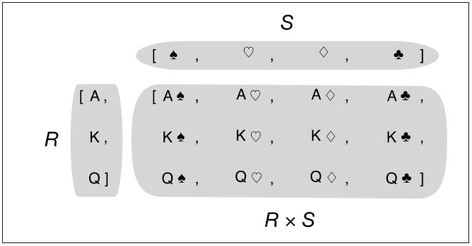

# Chap02 - 시퀀스 An array of sequences

파이썬에서 제공하는 다양한 시퀀스를 이해하면 코드를 새로 구현할 필요가 없으며, 시퀀스의 공통 인터페이스를 따라 기존 혹은 향후에 구현될 시퀀스 자료형을 적절히 지원하고 활용할 수 있게 API를 정의할 수 있다.


## 2.1 내장 시퀀스 개요

파이썬은 C로 구현된 다음과 같은 시퀀스들을 제공한다.

- ***컨테이너 시퀀스*** : 서로 다른 자료형의 항목들을 담을 수 있는 `list, tuple, collections.deque` 형태
- ***균일 시퀀스*** : 하나의 자료형만 담을 수 있는 `str, bytes, memoryview, array.array` 형태

컨테이너 시퀀스(container sequence)는 객체에 대한 참조를 담고 있으며 객체는 어떠한 자료형도 될 수 있다. 하지만, 균일 시컨스(flat sequence)는 객체에 대한 참조 대신 자신의 메모리 공간에 각 항목의 값을 직접 담는다. 따라서, 균일 시퀀스가 메모리를 더 적게 사용하지만, 문자, 바이트, 숫자 등 기본적인 자료형만 저장할 수 있다. <br />

시퀀스는 다음과 같이 가변성에 따라 분류할 수도 있다.

- ***가변 시퀀스*** : `list, bytearray, array.array, collections.deque, memoryview` 등
- ***불변 시퀀스*** : `tuple, str, bytes` 등


## 2.2 리스트 컴프리헨션과 제너레이터 표현식

리스트 컴프리헨션(listcomp, List Comprehension)이나 제너레이터 표현식(genexp, Generator Expression)을 사용하면 시퀀스를 간단히 생성할 수 있다. 


### 2.2.1 리스트 컴프리헨션과 가독성

아래의 [예제 2-1]과 [예제 2-2]를 보도록 하자. 

```python
# 예제 2-1 : 문자열에서 유니코드 코드 포인트 리스트 만들기 ver01 
>>> symbols = '$¢£¥€¤'
>>> codes = []
>>> for symbol in symbols:
    	codes.append(ord(symbol))
    
>>> codes
[36, 162, 163, 165, 8364, 164]


# 예제 2-2 : 문자열에서 유니코드 코드 포인트 리스트 만들기 ver02
>>> symbols = '$¢£¥€¤'
>>> codes = [ord(symbol) for symbol in symbols]
>>> codes
[36, 162, 163, 165, 8364, 164]
```

[예제 2-1]은 `for` 루프를 이용해서 `codes` 리스트를 만들고, [예제 2-2]는 `listcomp`를 이용해서 `codes`리스트를 만든다. 파이썬에 익숙한 사람들은 리스트 컴프리헨션 방법이 가독성이 더 좋다는 것을 알 수 있다. (실제로 저도 그렇네요ㅎㅎ) <br />

하지만, 그렇다고 해서 리스트 컴프리헨션을 남용해서는 안된다. 리스트 컴프리헨션을 사용할 경우 구문이 두 줄이상 넘어가는 경우나 다중 `for`문을 사용하는 경우 [예제 2-1]처럼 코드를 분할해서 사용하는 것이 오히려 더 낫다. 


### 2.2.2 리스트 컴프리헨션과 `map()/filter()` 비교

위의 [예제 2-1]과 [예제 2-2]를 `map()`과 `filter()`를 사용해서 [예제 2-3]처럼 구현할 수 있다. 

```python
# [예제 2-3] - map/filter 로 만든 codes 리스트
>>> symbols = '$¢£¥€¤'
>>> codes = list(filter(lambda c: c > 1, map(ord, symbols)))
>>> codes
[36, 162, 163, 165, 8364, 164]
```

하지만, 가독성은 [예제 2-2]보다 떨어진다. 


### 2.2.3 데카르트 곱

이번에는 리스트 컴프리헨션을 이용해 데카르트 곱을 구현해 보자. 데카르트 곱(곱집합)에 대해서는 [wikipedia](https://ko.wikipedia.org/wiki/%EA%B3%B1%EC%A7%91%ED%95%A9)를 참고하면 된다. 아래의 그림은 데카르트 곱에 대한 예제이다.



다음 [예제 2-4] 와 같이 두 가지 색상과 세 가지 크기의 티셔츠에 대해 데카르트 곱을 통해 리스트를 만들게 되면 총 6가지 항목이 만들어 진다.

```python
# [예제 2-4] 리스트 컴프리헨션을 이용한 데카르트 곱
>>> colors = ['black', 'white']
>>> sizes = ['S', 'M', 'L']
>>> tshirts = [(color, size) for color in colors 
                             for size in sizes]
>>> tshirts
[('black', 'S'),
 ('black', 'M'),
 ('black', 'L'),
 ('white', 'S'),
 ('white', 'M'),
 ('white', 'L')]
```


### 2.2.4 제너레이터 표현식

튜플(tuple), 배열(array) 등의 시퀀스를 초기화 하기위해서는 리스트 컴프리헨션을 사용할 수도 있지만, 리스트를 한번에 통째로 만들지 않고, 반복자 프로토콜(iterator protocol)을 이용하여 항목을 하나씩 생성하는 제너레이터(generator) 표현식을 사용하면 메모리를 더 적게 사용한다. 

제너레이터 표현식은 리스트 컴프리헨션과 동일한 구문을 사용하지만, 대괄호`[]`가 아닌 괄호`()`를 사용한다.

[예제 2-5]는 제너레이터 표현식을 이용해 튜플을 생성하는 코드이다.

```python
# [예제 2-5] - 제너레이터 표현식을 이용한 튜플, 배열 초기화
>>> symbols = '$¢£¥€¤'
>>> tuple(ord(symbol) for symbol in symbols)
(36, 162, 163, 165, 8364, 164)

>>> import array
>>> array.array('I', (ord(symbol) for symbol in symbols))
array('I', [36, 162, 163, 165, 8364, 164])
```


아래의 [예제 2-6]은 데카르트 곱을 제너레이터 표현식을 사용해 [예제 2-4]를 구현한 코드이다. [예제 2-4]와 달리 [예제 2-6]은 생성된 리스트의 항목을 메모리에 할당하지 않는다. 제너레이터 표현식은 한번에 한 항목을 생성할 수 있도록 설정되어 있기 때문에 [예제 2-6]과 같이 `for` 루프에 데이터를 전달한다. 따라서, 항목이 많은 리스트를 생성할 때 생길 수 있는 메모리 부족 문제를 해결할 수 있다.

```python
# [예제 2-6] - 제너레이터 표현식을 이용한 데카르트 곱
>>> colors = ['black', 'white']
>>> sizes = ['S', 'M', 'L']
>>> for tshirt in ('%s %s' % (c, s) for c in colors for s in sizes):
    	print(tshirt)

black S
black M
black L
white S
white M
white L
```


## 2.3 튜플은 단순한 불변 리스트가 아니다

